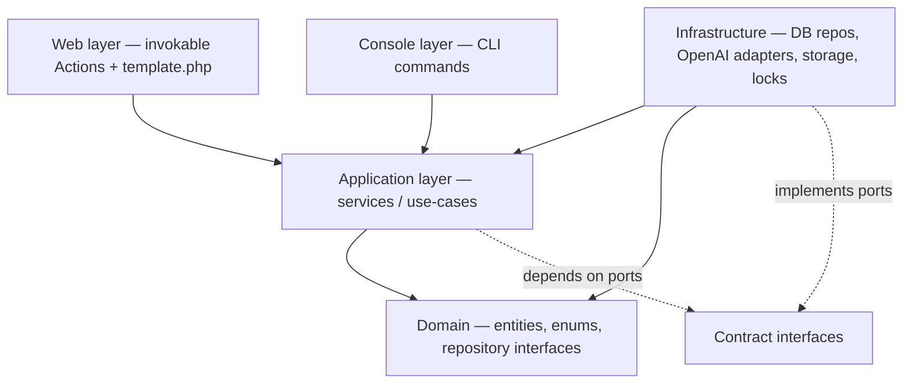
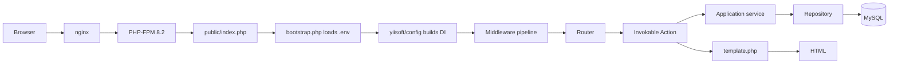
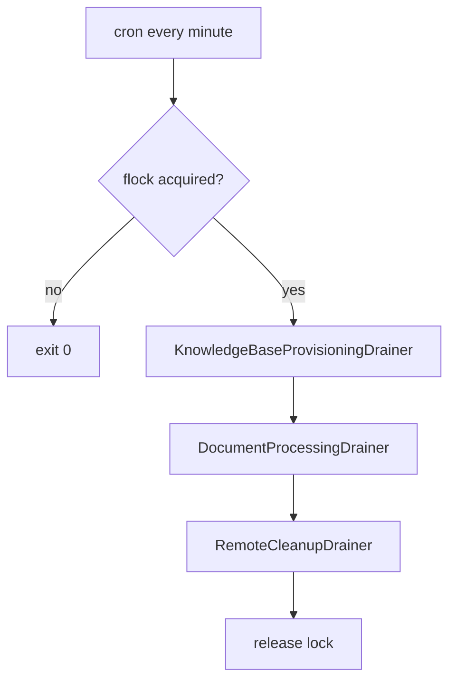
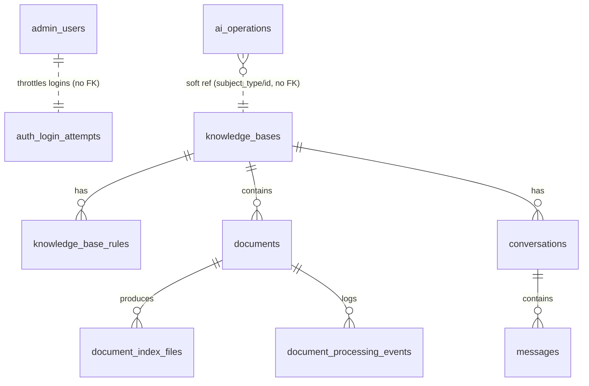

# Knowledge Forge — Architecture, Data Model & Integration Guide

A source-verified developer reference for **how this project works internally**, its **complete database
structure**, and **how to extend it or link it to another project**. Everything here was read from the
actual files in `/var/www/html/knowledge-forge` (migrations, routes, `composer.json`, domain classes,
contracts).

> **How this file differs from the others** — read the right one for the job:
> - [`README.md`](../README.md) — install & run.
> - [`docs/PROJECT_GUIDE.md`](PROJECT_GUIDE.md) — **operations**: login, deploy, env vars, commands,
>   troubleshooting, cheat sheet.
> - **This file** — **engineering**: internal architecture, the full data dictionary, extension recipes,
>   and cross-project integration. Start here when you want to *add a feature* or *connect another app*.

> **Secrets note:** no real keys, passwords, or hashes appear here. Real values live only in `.env`
> (git-ignored).

---

## Table of contents

1. [What Knowledge Forge is](#1-what-knowledge-forge-is)
2. [System architecture](#2-system-architecture)
3. [The two execution tiers](#3-the-two-execution-tiers-the-most-important-rule)
4. [Module map](#4-module-map)
5. [Request & worker lifecycles](#5-request--worker-lifecycles)
6. [Complete database structure (data dictionary)](#6-complete-database-structure-data-dictionary)
7. [Status lifecycles (state machines)](#7-status-lifecycles-state-machines)
8. [Cross-table invariants](#8-cross-table-invariants-you-must-preserve)
9. [Domain object model](#9-domain-object-model)
10. [The AI integration seam](#10-the-ai-integration-seam)
11. [Configuration & environment flow](#11-configuration--environment-flow)
12. [Extending the system (recipes)](#12-extending-the-system-recipes)
13. [Linking Knowledge Forge to another project](#13-linking-knowledge-forge-to-another-project)
14. [Invariants & safety rules to preserve](#14-invariants--safety-rules-to-preserve)
15. [File-location index](#15-file-location-index)

---

## 1. What Knowledge Forge is

An **admin-only** knowledge-base chat application. An administrator creates *knowledge bases*, uploads
PDFs/images into them, and asks questions answered **only from those documents, with real citations** —
or with an explicit fallback sentence when the documents cannot support an answer.

**The core guarantee:** every answer is forced through hosted retrieval (OpenAI Vector Stores + the File
Search tool) and a server-side **grounding verifier**. An answer not backed by a retrieved, citable
document is replaced by a safe fallback rather than a guess.

**Stack (from `composer.json`):** PHP `8.2–8.5`; Yii3 component set (`yiisoft/di`, `yiisoft/router`,
`yiisoft/db` + `-mysql` + `-migration`, `yiisoft/view`, `yiisoft/session`, `yiisoft/csrf`,
`yiisoft/validator`, `yiisoft/config`, `yiisoft/yii-runner-http`/`-console`); `guzzlehttp/guzzle` +
`guzzlehttp/psr7` (HTTP to OpenAI); `league/commonmark` (safe Markdown); `smalot/pdfparser` (PDF text
probe); `vlucas/phpdotenv` (`.env`). **There is no OpenAI SDK** — the app talks to OpenAI through its own
small typed gateway over ~10 endpoints.

---

## 2. System architecture

Clean, layered ("hexagonal") architecture. Dependencies point **inward**; the Domain layer knows nothing
about Yii, PSR-HTTP, PDO, Guzzle, or OpenAI.



| Layer | Path pattern | Contains | Depends on |
|---|---|---|---|
| **Domain** | `src/*/Domain/` | Entities (`KnowledgeBase`, `Document`, `Message`…), enums, value objects, **repository interfaces** | nothing framework-specific |
| **Application** | `src/*/Application/` | Use-cases (`UploadDocumentService`, `AskKnowledgeBaseService`…), config value objects, ports' *consumers* | Domain + `Ai\Contract\*` |
| **Infrastructure** | `src/*/Infrastructure/`, `src/Ai/OpenAi/` | `Db*Repository`, OpenAI HTTP client/adapters, `LocalDocumentStorage`, `FlockWorkerLock` | *implements* Domain/Contract interfaces |
| **Web** | `src/*/Web/` | `final readonly` invokable actions + colocated `template.php` | Application |
| **Console** | `src/*/Console/` | CLI commands | Application |

**Boundary enforcement (verified):** `getenv()` appears only in `src/Environment.php`;
`composer-dependency-analyser.php` scans `src/` as non-dev so every `use`d package is a real `require`;
Psalm runs at its strictest level. Each feature module repeats the same five sub-layers.

Every module follows **vertical slicing with no controllers**: a route maps to an invokable
`final readonly` action class; its view is the `template.php` sitting next to it.

---

## 3. The two execution tiers (the most important rule)

The single most important architectural fact: **OpenAI is called synchronously from the web tier in
exactly one place — chat.** Everything else that touches OpenAI runs in the background cron worker.

| Operation | Tier | Why |
|---|---|---|
| Vector-store **provisioning** (KB create/retry) | **Worker only** | Non-idempotent create; must be reconcilable |
| File upload, attach, index polling | **Worker only** | Minutes-long, unbounded |
| Vision extraction (image / scanned PDF) | **Worker only** | The most expensive path |
| Re-index, remote delete/detach | **Worker only** | UI enqueues, returns immediately |
| **Chat `POST /responses`** | **Web tier — one bounded synchronous call** | It *is* the product; deferring it would mean polling for an answer |

Two DI client profiles enforce this split (`config/common/di/ai.php`, built in `app-params.php`):

| Profile (DI id) | Used by | Timeouts | Retries |
|---|---|---|---|
| `ai.client.chat` | `OpenAiChatCompletionProvider` (chat) | short (`OPENAI_CHAT_*`) | 1 |
| `ai.client.worker` | `OpenAiKnowledgeIndex`, `OpenAiDocumentContentExtractor` (ingestion) | long (`OPENAI_WORKER_*`) | 3 |

**When you add a feature, keep this rule.** Any new remote/slow work belongs in a worker drainer, not in
a web action.

---

## 4. Module map

| Module | Responsibility | Key classes | Backing tables |
|---|---|---|---|
| `src/Shared/` | Cross-cutting utilities | `SystemClock`, `SecretValue`, `SecretRedactor`, `SafeLogContext`, `MarkdownRenderer`, `DbParams`, middleware, admin layout | — |
| `src/Auth/` | Login, admins, throttle | `LoginService`, `DbAdminUserRepository`, `NativePasswordHasher`, `SessionAdminIdentityStore`, `DbLoginThrottle`, `RequireAdminMiddleware`, `CreateAdminCommand` | `admin_users`, `auth_login_attempts` |
| `src/KnowledgeBase/` | KBs + rules + provisioning | `CreateKnowledgeBaseService`, `RuleService`, `ArchiveKnowledgeBaseService`, `DbKnowledgeBaseRepository`, `DbRuleRepository` | `knowledge_bases`, `knowledge_base_rules` |
| `src/Document/` | Upload + ingestion pipeline | `UploadDocumentService`, `ProcessDocumentService`, `DocumentProcessorRegistry`, `PdfDocumentProcessor`, `ImageDocumentProcessor`, `LocalDocumentStorage`, `UploadValidator` | `documents`, `document_index_files`, `document_processing_events` |
| `src/Chat/` | Grounded chat | `AskKnowledgeBaseService`, `InstructionBuilder`, `RecentMessagesHistoryPolicy`, `CitationResolver`, `GroundingVerifier` | `conversations`, `messages` |
| `src/Worker/` | Background runner | `WorkerRunner`, `DrainerInterface`, `FlockWorkerLock`, `RunWorkerCommand`, `RecoverDocumentsCommand`, `ReconcileCommand` | (drives all status columns) |
| `src/Ai/` | OpenAI gateway + ledger + usage | `Contract/*` ports & DTOs, `OpenAi/Client/*`, adapters, `AiOperationReconciler`, usage dashboard | `ai_operations` |
| `src/Migration/` | Schema migrations | `M…Create*.php` (8 files) | all |
| `src/Web/` | Dashboard, error, layout shell | `Dashboard\Action`, shared layouts | — |
| `src/Environment.php` | **Only** place env vars are read | typed fail-fast accessors | — |

> The **OpenAI usage dashboard** (`src/Ai/Application/Usage/`, `src/Ai/Web/Usage/`, routes
> `ai.usage.index` / `ai.usage.sync` at `/admin/openai-usage`) is an operator diagnostic reached by
> direct URL — deliberately absent from the sidebar. It is still admin-session-gated.

---

## 5. Request & worker lifecycles

### Web request



Middleware order (`config/web/di/application.php`): `ErrorCatcher` → `SecurityHeadersMiddleware` →
`CorrelationIdMiddleware` → `SessionMiddleware` → `CsrfTokenMiddleware` → `RequestCatcherMiddleware` →
`Router`. Admin routes add `RequireAdminMiddleware` + `DomainExceptionMiddleware` inside the group.

### Worker (cron, one pass)



**There is no job-queue table.** "Jobs" are rows in `knowledge_bases`, `documents`,
`document_index_files`, and `ai_operations` whose **status columns are the state machine**. Each drainer
implements `App\Worker\Application\DrainerInterface` and is run by `WorkerRunner`. **Claiming** is an
atomic conditional `UPDATE … WHERE status = <eligible>` (affected-rows must equal 1), so two workers never
process the same item.

---

## 6. Complete database structure (data dictionary)

- **Engine/charset:** InnoDB, `utf8mb4_0900_ai_ci`. **Timestamps are UTC** (connection sets
  `time_zone = '+00:00'`). Surrogate keys are `BIGINT` **signed** (`ColumnBuilder::bigPrimaryKey()`);
  child FK columns are signed to match (MySQL rejects a FK whose signedness differs).
- Table names shown are literal (this app uses an empty table prefix).
- **Booleans:** `is_active`/`is_enabled`/`pending_removal` are **`TINYINT(1)`** (chosen so the flag
  round-trips as `"0"`/`"1"` through the string-typed PDO fetch). ⚠️ **`messages.is_grounded` is the one
  exception — it is defined with `ColumnBuilder::boolean()`, which is `BIT(1)`.** An external reader gets
  a bit, not a plain 0/1 string; account for that if you query it directly. See §13.



### 6.1 `admin_users` — administrator accounts
Migration `M260724100000CreateAdminUsers`.

| Column | Type | Null | Default | Notes |
|---|---|---|---|---|
| `id` | BIGINT (signed) PK AI | no | — | |
| `username` | VARCHAR(64) | no | — | **UNIQUE** `ux_admin_users_username` |
| `password_hash` | VARCHAR(255) | no | — | `password_hash(PASSWORD_DEFAULT)`; 255 sizes for future algorithms |
| `is_active` | TINYINT(1) | no | `1` | honoured at login |
| `last_login_at` | DATETIME | yes | NULL | set on successful login |
| `created_at` / `updated_at` | DATETIME | no | — | UTC |

### 6.2 `auth_login_attempts` — login throttle
Migration `M260724100300CreateAuthLoginAttempts`. **No `id`** — natural PK.

| Column | Type | Null | Default | Notes |
|---|---|---|---|---|
| `attempt_key` | CHAR(64) | no | — | **PK**; `sha256("username|ip")` — no plaintext identifiers stored |
| `attempts` | SMALLINT UNSIGNED | no | `0` | failures in the window |
| `window_started_at` | DATETIME | no | — | |
| `locked_until` | DATETIME | yes | NULL | set once threshold crossed |
| `updated_at` | DATETIME | no | — | indexed `ix_auth_login_attempts_updated` for cheap cleanup |

### 6.3 `knowledge_bases` — KBs + provisioning state
Migration `M260724100100CreateKnowledgeBases`. Each KB maps **1:1** to one OpenAI vector store.

| Column | Type | Null | Default | Notes |
|---|---|---|---|---|
| `id` | BIGINT PK AI | no | — | |
| `name` | VARCHAR(160) | no | — | |
| `slug` | VARCHAR(160) | no | — | **UNIQUE** `ux_knowledge_bases_slug`; the public URL key |
| `description` | TEXT | yes | NULL | |
| `system_instructions` | TEXT | yes | NULL | admin free text, applied **below** the immutable security preamble — can never override it |
| `openai_vector_store_id` | VARCHAR(64) | yes | NULL | **UNIQUE** `ux_knowledge_bases_vector_store` (NULLs distinct → many rows may await provisioning) |
| `vector_store_status` | ENUM(`pending`,`provisioning`,`ready`,`failed`) | no | `pending` | see §7 |
| `provision_attempts` | SMALLINT UNSIGNED | no | `0` | |
| `provision_started_at` | DATETIME | yes | NULL | worker claim marker (crash recovery) |
| `provision_next_attempt_at` | DATETIME | yes | NULL | backoff; **NULL = eligible now** |
| `vector_store_error_code` | VARCHAR(64) | yes | NULL | |
| `vector_store_error` | VARCHAR(500) | yes | NULL | redacted + truncated |
| `status` | ENUM(`active`,`archived`) | no | `active` | archive hides from list + blocks chat |
| `created_at` / `updated_at` | DATETIME | no | — | |

Indexes: `ix_knowledge_bases_provisioning(vector_store_status, provision_next_attempt_at, id)` (worker
claim), `ix_knowledge_bases_status_name(status, name)` (list screen).

### 6.4 `knowledge_base_rules` — prioritised answer rules
Migration `M260724100200CreateKnowledgeBaseRules`. Provider-neutral: plain text rendered into the prompt.

| Column | Type | Null | Default | Notes |
|---|---|---|---|---|
| `id` | BIGINT PK AI | no | — | |
| `knowledge_base_id` | BIGINT (signed) | no | — | **FK** → `knowledge_bases(id)` **ON DELETE/UPDATE CASCADE** |
| `name` | VARCHAR(160) | no | — | **UNIQUE** with KB: `ux_knowledge_base_rules_name(knowledge_base_id, name)` |
| `instruction` | TEXT | no | — | |
| `priority` | SMALLINT UNSIGNED | no | `100` | **lower wins**; gaps intentional (insert between two rules without renumbering) |
| `is_enabled` | TINYINT(1) | no | `1` | |
| `created_at` / `updated_at` | DATETIME | no | — | |

Index `ix_knowledge_base_rules_active(knowledge_base_id, is_enabled, priority, id)` exactly matches the
instruction builder's query (enabled rules for one KB, priority order).

### 6.5 `documents` — uploaded files + lifecycle
Migration `M260725120000CreateDocuments`.

| Column | Type | Null | Default | Notes |
|---|---|---|---|---|
| `id` | BIGINT PK AI | no | — | |
| `knowledge_base_id` | BIGINT (signed) | no | — | **FK** → `knowledge_bases(id)` **CASCADE** |
| `original_filename` | VARCHAR(255) | no | — | display only, always HTML-escaped; **never** a filesystem path |
| `stored_path` | VARCHAR(512) | no | — | **relative** to storage root; never rendered |
| `storage_token` | CHAR(32) | no | — | random token in the stored filename + OpenAI upload name → deterministic reconciliation |
| `mime_type` | VARCHAR(128) | no | — | **server-detected**, never the browser value |
| `extension` | VARCHAR(16) | no | — | from detected MIME allow-list |
| `size_bytes` | BIGINT UNSIGNED | no | — | |
| `checksum_sha256` | CHAR(64) | no | — | |
| `kind` | VARCHAR(32) | no | — | `pdf`\|`image` today. **VARCHAR not ENUM** → a new processor needs no migration |
| `status` | ENUM(`uploaded`,`queued`,`processing`,`indexing`,`ready`,`failed`,`deleted`) | no | `uploaded` | see §7 |
| `priority` | TINYINT UNSIGNED | no | `0` | "Process now" raises it |
| `processing_attempts` | SMALLINT UNSIGNED | no | `0` | |
| `processing_started_at` | DATETIME | yes | NULL | claim marker (stuck recovery) |
| `next_attempt_at` | DATETIME | yes | NULL | backoff |
| `error_code` | VARCHAR(64) | yes | NULL | |
| `error_message` | VARCHAR(1000) | yes | NULL | redacted + capped |
| `processed_at` | DATETIME | yes | NULL | |
| `deleted_at` | DATETIME | yes | NULL | soft-delete marker |
| `created_at` / `updated_at` | DATETIME | no | — | |
| `dedupe_hash` | CHAR(64) **generated STORED** | yes | — | `IF(status='deleted', NULL, checksum_sha256)` |

**The generated column is deliberate.** `UNIQUE(knowledge_base_id, dedupe_hash)` (`ux_documents_dedupe`)
rejects a live duplicate but — because deleted rows have `NULL` hash and MySQL treats NULLs as distinct —
**allows re-uploading a previously deleted file**. Enforced by the database, not a racy app check. This is
the *only* raw SQL in the migrations (`MigrationBuilder` has no generated-column API). Other indexes:
`ix_documents_kb_status(knowledge_base_id, status, created_at)` (list), `ix_documents_queue(status,
priority, next_attempt_at, id)` (worker claim).

### 6.6 `document_index_files` — OpenAI artifacts per document
Migrations `M260725120000` + `M260726090000AddIndexFileRemovalFlag`. A text PDF yields one `source` row;
an image or scanned PDF yields a `derived_markdown` row. Kept as a child table so a citation's file id
resolves back to the **original** document (and thus its original filename), however many artifacts exist.

| Column | Type | Null | Default | Notes |
|---|---|---|---|---|
| `id` | BIGINT PK AI | no | — | |
| `document_id` | BIGINT (signed) | no | — | **FK** → `documents(id)` **CASCADE** |
| `role` | ENUM(`source`,`derived_markdown`) | no | — | |
| `derived_path` | VARCHAR(512) | yes | NULL | generated `.md` path for a derived artifact; NULL for source |
| `openai_file_id` | VARCHAR(64) | yes | NULL | **UNIQUE** `ux_index_files_openai` (NULLs distinct) — the citation resolution key |
| `index_status` | ENUM(`pending`,`in_progress`,`completed`,`failed`,`cancelled`) | no | `pending` | see §7 |
| `usage_bytes` | BIGINT UNSIGNED | yes | NULL | |
| `last_error_code` | VARCHAR(64) | yes | NULL | |
| `last_error_message` | VARCHAR(1000) | yes | NULL | |
| `pending_removal` | TINYINT(1) | no | `0` | flagged for the cleanup drainer to detach+delete remotely; active processing ignores flagged rows |
| `created_at` / `updated_at` | DATETIME | no | — | |

Indexes: `ix_index_files_document(document_id, role)`, `ix_index_files_removal(pending_removal)`.

### 6.7 `document_processing_events` — per-document audit log
Migration `M260725120000`. Append-only.

| Column | Type | Null | Default | Notes |
|---|---|---|---|---|
| `id` | BIGINT PK AI | no | — | |
| `document_id` | BIGINT (signed) | no | — | **FK** → `documents(id)` **CASCADE** |
| `status` | VARCHAR(32) | no | — | |
| `message` | VARCHAR(1000) | yes | NULL | redacted before write |
| `metadata_json` | JSON | yes | NULL | |
| `created_at` | DATETIME | no | — | (no `updated_at` — append-only) |

Index `ix_events_document(document_id, id)`.

### 6.8 `ai_operations` — non-idempotent operation ledger
Migration `M260725140000CreateAiOperations`. `Idempotency-Key` is sent best-effort but **never trusted**;
correctness comes from this ledger + the reconciler, so a retry can never silently create a duplicate
store/file.

| Column | Type | Null | Default | Notes |
|---|---|---|---|---|
| `id` | BIGINT PK AI | no | — | |
| `operation_key` | VARCHAR(191) | no | — | **UNIQUE** `ux_ai_operations_key`; deterministic, e.g. `vs.create:kb:12`, `file.upload:indexed_file:88` |
| `type` | VARCHAR(64) | no | — | |
| `subject_type` | VARCHAR(32) | no | — | polymorphic (`kb`, `indexed_file`…) — **no FK** |
| `subject_id` | BIGINT **UNSIGNED** | no | — | (unsigned; no FK so signedness is free) |
| `status` | ENUM(`pending`,`in_flight`,`succeeded`,`needs_reconcile`,`failed`) | no | `pending` | see §7 |
| `request_fingerprint` | CHAR(64) | yes | NULL | distinguishes a genuine reconcile match from coincidence |
| `idempotency_key` | CHAR(36) | yes | NULL | |
| `result_id` | VARCHAR(64) | yes | NULL | resulting provider id on success |
| `attempts` | SMALLINT UNSIGNED | no | `0` | |
| `next_attempt_at` | DATETIME | yes | NULL | |
| `last_error_code` / `last_error_message` | VARCHAR(64) / VARCHAR(1000) | yes | NULL | |
| `started_at` / `completed_at` | DATETIME | yes | NULL | |
| `created_at` / `updated_at` | DATETIME | no | — | |

Indexes: `ix_ai_operations_status(status, next_attempt_at, id)` (reconcile queue),
`ix_ai_operations_subject(subject_type, subject_id)`.

### 6.9 `conversations` — chat threads
Migration `M260727100000CreateConversations`.

| Column | Type | Null | Default | Notes |
|---|---|---|---|---|
| `id` | BIGINT PK AI | no | — | |
| `knowledge_base_id` | BIGINT (signed) | no | — | **FK** → `knowledge_bases(id)` **CASCADE** |
| `title` | VARCHAR(255) | no | — | |
| `last_message_at` | DATETIME | yes | NULL | |
| `created_at` / `updated_at` | DATETIME | no | — | |

Index `ix_conversations_kb_activity(knowledge_base_id, last_message_at, id)` (list order, newest first).

### 6.10 `messages` — chat messages
Migration `M260727100000CreateConversations`. Citations/usage are stored as JSON alongside the message
(always read *with* the message, never queried across messages in v1). The resolved `document_id` is kept
inside the citation JSON so rendering never re-queries.

| Column | Type | Null | Default | Notes |
|---|---|---|---|---|
| `id` | BIGINT PK AI | no | — | |
| `conversation_id` | BIGINT (signed) | no | — | **FK** → `conversations(id)` **CASCADE** |
| `role` | ENUM(`user`,`assistant`) | no | — | |
| `content` | TEXT | no | — | |
| `citations_json` | JSON | yes | NULL | resolved citations incl. `document_id` + display filename |
| `usage_json` | JSON | yes | NULL | per-answer token usage |
| `is_grounded` | **BIT(1)** (`boolean()`) | no | `0` | retrieval verified **and** ≥1 citation resolved. ⚠️ see the boolean note in §6 |
| `retrieval_status` | VARCHAR(32) | yes | NULL | `file_search_call` status, or `not_called` — the grounding audit trail |
| `openai_response_id` | VARCHAR(64) | yes | NULL | |
| `model` | VARCHAR(64) | yes | NULL | |
| `created_at` | DATETIME | no | — | (no `updated_at` — messages are immutable) |

Index `ix_messages_conversation(conversation_id, id)`.

---

## 7. Status lifecycles (state machines)

The worker advances these; the UI reads them. No separate queue.

**`knowledge_bases.vector_store_status`**
```
pending ──claim──▶ provisioning ──ok──▶ ready
   ▲                    └──error/backoff──▶ failed
   └──────────── "Retry provisioning" (UI resets) ────────────┘
```

**`documents.status`**
```
uploaded ─▶ queued ─claim─▶ processing ─▶ indexing ─poll ok─▶ ready
                 ▲   │                         │
   "Retry" ──────┘   └──error(<max attempts,backoff)──▶ queued
   (from failed)     └──error(≥max attempts)──────────▶ failed
ready ──"Re-index"──▶ queued        any ──"Delete"──▶ deleted (files flagged pending_removal)
```

**`document_index_files.index_status`**: `pending → in_progress → completed | failed | cancelled`.

**`ai_operations.status`**
```
pending ─▶ in_flight ─clean success─▶ succeeded
   ▲           │
   │           ├─ failure BEFORE side effect ─▶ pending (safe retry)
   │           └─ AMBIGUOUS failure ─▶ needs_reconcile ─reconcile─▶ succeeded | pending | failed
   └──────────────────────────────────────────────────────────────────────┘
```
`needs_reconcile` is **never blind-retried**: `AiOperationReconciler` queries OpenAI, adopts any object
that was actually created (matched by `metadata.kf_op` / upload name), and only then marks `succeeded`.

---

## 8. Cross-table invariants (you must preserve)

1. **KB ↔ vector store is 1:1** — enforced by `UNIQUE(openai_vector_store_id)`.
2. **Citation resolution path:** `openai_file_id` (from `file_search` results / `messages.citations_json`)
   → `document_index_files.openai_file_id` → `document_id` → `documents.original_filename`. This is why a
   citation shows `invoice-scan.png`, not the derived `.md`. Unresolvable ids are dropped, never invented.
3. **Dedupe** is per KB, over *live* documents only (`ux_documents_dedupe` on the generated `dedupe_hash`).
4. **Cascade deletes:** deleting a `knowledge_bases` row cascades to `knowledge_base_rules`, `documents`
   (→ `document_index_files`, `document_processing_events`), and `conversations` (→ `messages`).
   **`ai_operations` is NOT cascaded** (soft polymorphic ref) — orphan ledger rows are harmless and
   swept by the reconciler/attempt cap. Deleting a KB in SQL does **not** delete the remote OpenAI
   store — do that through the app so cleanup is enqueued.
5. **All timestamps are UTC.** Any external writer must write UTC.
6. **Never write `documents.stored_path` or `openai_file_id` to a URL or HTML** — IDOR/leak surface.

---

## 9. Domain object model

Entities are plain PHP (`src/*/Domain/`), hydrated by `Db*Repository` classes and consumed by services.

| Entity | Table | Enums / value objects | Repository interface(s) |
|---|---|---|---|
| `Auth\Domain\AdminUser` | `admin_users` | — | `AdminUserRepositoryInterface`, throttle port |
| `KnowledgeBase\Domain\KnowledgeBase` | `knowledge_bases` | `KnowledgeBaseStatus`, `VectorStoreStatus`, `ProvisioningCandidate` | `KnowledgeBaseRepositoryInterface`, `KnowledgeBaseProvisioningRepositoryInterface` |
| `KnowledgeBase\Domain\Rule` | `knowledge_base_rules` | — | `RuleRepositoryInterface` |
| `Document\Domain\Document` (+ `NewDocument`) | `documents` | `DocumentKind`, `DocumentStatus` | `DocumentRepositoryInterface`, `DocumentProcessingRepositoryInterface` |
| `Document\Domain\IndexedFile` | `document_index_files` | `IndexedFileRole` | `IndexedFileRepositoryInterface` |
| `Document\Domain\ProcessingEvent` | `document_processing_events` | — | `ProcessingEventRepositoryInterface` |
| `Chat\Domain\Conversation` | `conversations` | — | `ConversationRepositoryInterface` |
| `Chat\Domain\Message` (+ `NewMessage`) | `messages` | `MessageRole`, `ResolvedCitation` | `MessageRepositoryInterface` |

Repositories are the **only** place SQL lives. To change how an entity is stored, change its
`Db*Repository`; the interface (used by services) stays stable.

---

## 10. The AI integration seam

The app depends on three **ports** in `src/Ai/Contract/`; OpenAI is one adapter set behind them. Swap the
provider by writing new adapters and rebinding in `config/common/di/ai.php` — no service changes.

| Port | Method(s) | Adapter | Tier |
|---|---|---|---|
| `ChatCompletionProviderInterface` | `ask(GroundedAnswerRequest): GroundedAnswerResult` | `OpenAiChatCompletionProvider` | web (chat) |
| `KnowledgeIndexInterface` | `createStore`, `deleteStore`, `indexContent`, `fileState`, `removeFile` | `OpenAiKnowledgeIndex` | worker |
| `DocumentContentExtractorInterface` | extract Markdown from image / scanned PDF | `OpenAiDocumentContentExtractor` | worker |

DTOs (`src/Ai/Contract/Dto/`): `GroundedAnswerRequest`/`Result`, `ChatMessage`, `RawCitation`,
`IndexedFileResult`, `IndexState`, `IndexStatus`, `ExtractionResult`, `TokenUsage`, `AiErrorDetails`.
Errors normalise to the `AiException` hierarchy (`AiAuthenticationFailed`, `AiRateLimited`, `AiTimeout`,
`AiRequestTooLarge`, `AiTransportFailed`, `AiInvalidResponse`, `AiProcessingFailed`) — each already
redacted and carrying a "transient / possibly-had-a-side-effect" flag that drives retry vs reconcile.

The low-level typed HTTP client is `src/Ai/OpenAi/Client/` (`OpenAiClientInterface` + `HttpOpenAiClient`,
`RetryPolicy`, `MultipartFileUpload`, `ResponseParser`). Tests use `tests/Support/Fake/Ai/*` — **zero live
calls in the suite**.

---

## 11. Configuration & environment flow

```
.env  →  src/Environment.php (typed, fail-fast, the ONLY getenv() boundary)
      →  config/common/params.php (raw arrays under keys like 'app/db', 'app/openai')
      →  config/common/di/app-params.php (arrays → typed readonly objects)
      →  constructor injection into services
```

Typed config objects built in `app-params.php` include `DbParams`, `StoragePaths`, `OpenAiCredentials`,
`OpenAiAdminCredentials`, the two `OpenAiHttpProfile`s, plus `ChatParams`, `WorkerParams`, etc. built in
their module DI files. **No service ever calls `getenv()`.** The full env-var catalogue with defaults is
in [`PROJECT_GUIDE.md §12`](PROJECT_GUIDE.md) and `.env.example`.

After **any** change under `config/`, run `composer yii-config-rebuild`. `.env` changes need no rebuild,
but the web/worker tiers need a PHP-FPM reload (and re-run the ACL script — editing `.env` drops its ACL).

---

## 12. Extending the system (recipes)

### 12.1 Add a new admin page/route
1. `src/<Module>/Web/<Feature>/Action.php` — `final readonly` invokable action.
2. `template.php` next to it (see the immediate-`@var` docblock convention used across `Web/*/template.php`).
3. Register in `config/common/routes.php` **inside the admin `Group`** (so it's admin-gated).
4. Bind any new service in `config/common/di/<module>.php`; `composer yii-config-rebuild`.

### 12.2 Add a DB field or table
1. New migration `src/Migration/M<UTCstamp>Something.php` (`RevertibleMigrationInterface`, `ColumnBuilder`).
   Follow the house style: signed FK columns, `utf8mb4_0900_ai_ci`, indexes for the queries you'll run.
2. Update the entity + its `Db*Repository` (the only SQL site) + the repository interface if the surface
   changes.
3. `php yii migrate:up`. Keep migrations **additive** in production.

### 12.3 Add a new document type (the headline extension point)
Adding DOCX/TXT/etc. is a **new class + one registry entry** — no table or upload-action change:
1. Implement `Document\Application\Processing\DocumentProcessorInterface` (model on `PdfDocumentProcessor`
   / `ImageDocumentProcessor`). Decide: index directly (like a text PDF) or vision-extract to Markdown
   first (like an image).
2. Register it in `DocumentProcessorRegistry` keyed by `DocumentKind`.
3. Extend the MIME/type allow-list in `Document\Application\Validation\SupportedFileTypes` (+ `MimeTypeDetector`).
4. `documents.kind` is VARCHAR, so **no migration needed**.

### 12.4 Add a new AI provider (swap OpenAI)
Implement the three ports in §10 as new adapters and rebind them in `config/common/di/ai.php`. The Domain,
rules, chat service, and DB stay untouched — that's the whole point of the Contract layer.

### 12.5 Add a background job / worker drainer
1. Implement `Worker\Application\DrainerInterface`.
2. Register it in `WorkerRunner`'s drainer list (DI).
3. Drive it off a **status column** with an **atomic conditional claim** (`UPDATE … WHERE status=<x>`),
   backoff, an attempt cap, and stuck-recovery — mirror `DocumentProcessingDrainer`. Never add slow work
   to a web action.

### 12.6 Add a console command
`src/<Module>/Console/<Name>Command.php` (Symfony Console) and register it in
`config/console/commands.php`.

### 12.7 Add an environment variable
Declare a typed accessor in `src/Environment.php` → surface it in `config/common/params.php` → fold it
into a params object in `config/common/di/app-params.php` (or the module's DI file) →
`composer yii-config-rebuild`. Document it in `.env.example` and `PROJECT_GUIDE.md §12`.

---

## 13. Linking Knowledge Forge to another project

**Start here: know the current integration surface.**

- **There is no public HTTP/JSON API.** Every route in `config/common/routes.php` is server-rendered HTML
  behind `RequireAdminMiddleware` (session auth) + CSRF. `/admin/openai-usage` is the only non-navigation
  route and is still admin-session-gated. So you cannot "call an endpoint" from another app today —
  you must choose one of the options below.
- **KBs are addressed by `slug`** (stable, human-readable) — the natural external handle.
- **Retrieval lives in OpenAI vector stores** keyed by `knowledge_bases.openai_vector_store_id`.

Pick the integration style that fits:

### Option A — Database-level integration (another app reads/writes the same MySQL)
Fastest to stand up; highest coupling. **Cautions, all verifiable in §6:**
- `documents.dedupe_hash` is a **generated STORED** column — never write it; write `checksum_sha256` and
  let MySQL compute it. The dedupe UNIQUE constraint will reject live duplicates.
- **`messages.is_grounded` is `BIT(1)`** — read/write it as a bit, not `'0'`/`'1'`. The other flags
  (`is_active`, `is_enabled`, `pending_removal`) are `TINYINT(1)`.
- **Write UTC** timestamps; the app assumes `time_zone='+00:00'`.
- Respect **enums** exactly (`documents.status`, `vector_store_status`, …) — an out-of-range value errors.
- Respect **FK signedness** (signed `BIGINT` for `*_id`, except `ai_operations.subject_id` which is
  unsigned and FK-less).
- **Do not flip status columns by hand to trigger work** unless you understand the claim/backoff fields
  (`*_next_attempt_at`, `*_started_at`, `*_attempts`). Prefer enqueue semantics the app already uses.
- **Least privilege:** give the other app a MySQL account scoped to just the tables it needs; read-only
  wherever possible.
- **Foreign-keying *into* KF from another schema:** reference `knowledge_bases.id` (or store its `slug`)
  from your app's tables. A cross-schema FK requires both schemas on the same server and the same
  engine/charset; a stored `slug` + application-level join is looser and usually safer across services.

### Option B — Build a read/JSON API module *inside* Knowledge Forge (recommended for real integration)
Follow the module pattern (§12.1): add `src/Api/` (or `src/<Module>/Web/Api/`) invokable actions returning
JSON, e.g. list KBs, KB status, document status, or a server-to-server "ask" endpoint that wraps
`AskKnowledgeBaseService`. Because everything is currently behind session auth, add a **token/API-key
middleware** for machine callers (a new middleware alongside `RequireAdminMiddleware`, or a separate route
`Group` with its own auth). This keeps KF the single owner of its data and invariants while giving the
other project a clean contract. Reuse existing services — don't re-implement grounding/citations.

### Option C — Share the OpenAI vector store
Another app can run its own File Search against the same `openai_vector_store_id`. **Caveat:** that app
does **not** get KF's grounding verifier, immutable security preamble, or citation-resolution — it only
gets raw retrieval. Re-implement the guardrails on that side, or prefer Option B so answers stay grounded.
Never share the OpenAI **API key** into a browser/client; keep it server-side (as KF does).

### Option D — Link-out / embed by slug URL
Deep-link to `…/knowledge-bases/{slug}` or `…/knowledge-bases/{slug}/chat` from the other project's UI.
Because those pages require an admin session, this works cleanly only when both apps **share a session /
SSO** or sit behind the same auth proxy. Simplest when both are the same operator's admin tools.

### Shared authentication
KF auth is a single admin role in `admin_users` with PHP `password_hash`/`password_verify` and a
session-stored id (`SessionAdminIdentityStore`). To share identity with another project you'd either
(a) point both at the same `admin_users` table, (b) put both behind one SSO/reverse-proxy that injects an
identity KF trusts, or (c) issue API tokens (Option B). There is **no multi-role/permission system** —
adding one is schema + auth work, not a config toggle.

### Integration checklist
- [ ] Chosen style: A (DB) / B (API) / C (vector store) / D (link-out).
- [ ] Auth decided (shared `admin_users`, SSO, or API token) — never expose data un-gated.
- [ ] External DB account is least-privilege; never writes generated/derived columns.
- [ ] All timestamps UTC; enums and boolean widths (`BIT(1)` vs `TINYINT(1)`) respected.
- [ ] OpenAI key never leaves the server; vector-store sharing keeps grounding guarantees somewhere.
- [ ] Cross-project links use `slug` (stable) rather than internal `id` where feasible.
- [ ] Deletes go through the app (so remote OpenAI cleanup is enqueued), not raw SQL.

---

## 14. Invariants & safety rules to preserve

When adding features or integrating, do not break these — they are the product's guarantees:

1. **OpenAI only from the worker, except chat** (§3). New slow/remote work → a drainer.
2. **Immutable security preamble** goes first and is reasserted last in the prompt; admin rules and
   document text can never override it (`InstructionBuilder`). Document text is untrusted reference data.
3. **Grounding is server-verified** (`GroundingVerifier`): no retrieval / no usable results / no resolved
   citation ⇒ the configured fallback sentence, never an uncited guess.
4. **Citations resolve to real documents** or are dropped — never invented (§8.2).
5. **Secrets never leak:** `SecretValue` (throws on stringify), `SecretRedactor` scrubs `sk-…`/`Bearer …`
   before anything is logged **or persisted**; `SafeLogContext` is an allow-list. Keep new log/DB writes
   inside these.
6. **Non-idempotent remote creates go through the ledger** (`ai_operations`) so a retry can't duplicate a
   store/file.
7. **Uploads stay outside `public/`**, are MIME-sniffed server-side, extension from an allow-list, and
   path-traversal-checked (`LocalDocumentStorage`).
8. **IDOR:** every child lookup is scoped by parent id; internal ids/paths never appear in URLs or HTML.
9. **CSRF on every state change** (POST + token); destructive actions are never GET links.

---

## 15. File-location index

| You want… | Look in |
|---|---|
| URL map | `config/common/routes.php` |
| DI bindings | `config/common/di/*.php` (`ai.php`, `auth.php`, `chat.php`, `db.php`, `document.php`, `knowledge-base.php`, `worker.php`, `app-params.php`) |
| Env reading | `src/Environment.php` (only) → `config/common/params.php` |
| Schema | `src/Migration/M…Create*.php` (8 files) |
| Entities & enums | `src/*/Domain/` |
| SQL | `src/*/Infrastructure/Db*Repository.php` |
| AI ports & DTOs | `src/Ai/Contract/` |
| OpenAI client/adapters | `src/Ai/OpenAi/` |
| Document processors | `src/Document/Application/Processing/` |
| Upload validation | `src/Document/Application/Validation/` |
| Chat guardrails | `src/Chat/Application/` (`Instruction/`, `Grounding/`, `Citation/`, `History/`) |
| Worker | `src/Worker/` |
| Admin UI shell | `src/Web/Shared/Layout/Admin/`, `assets/main/admin.css`, `assets/main/admin.js` |
| Operations/deploy | [`docs/PROJECT_GUIDE.md`](PROJECT_GUIDE.md), `docs/deploy/`, `docs/nginx/` |
| Cost/technical audit | [`docs/OPENAI_TECHNICAL_AND_COST_AUDIT.md`](OPENAI_TECHNICAL_AND_COST_AUDIT.md) |

---

*Source-verified against the repository. When code changes, update this file — especially §6 (data
dictionary), §7 (state machines), and §13 (integration surface).*
