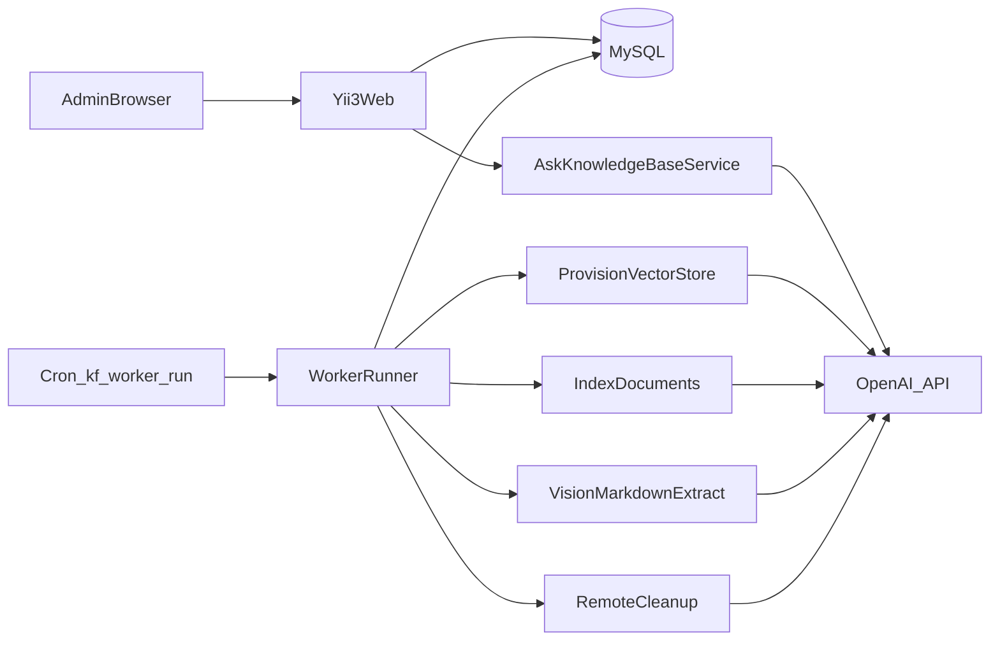
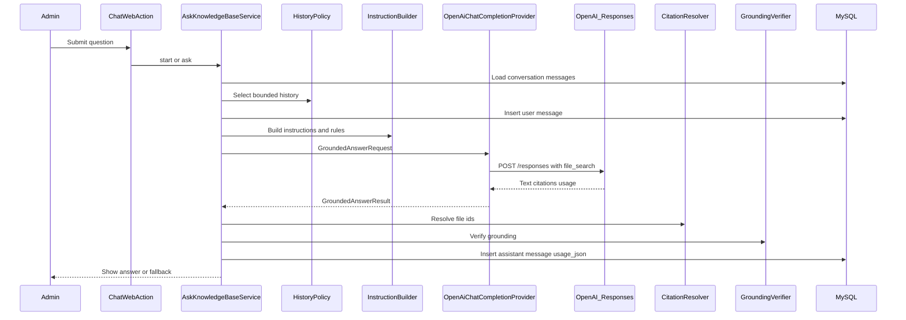

# Knowledge Forge — OpenAI Technical and Cost Audit

**Audit date:** 2026-07-29  
**Scope:** Read-only inspection of source code, configuration, migrations, and the local MySQL database.  
**No code, configuration, environment, or database records were modified.**

> **Secrets note:** This report never shows real API keys, passwords, or full `.env` contents. Masked examples look like `OPENAI_API_KEY=sk-****hLgA`.

### How to read claim tags

| Tag | Meaning |
| --- | --- |
| **Confirmed from code** | Verified in PHP source, migrations, or DI wiring |
| **Confirmed from configuration** | Verified in `.env` / `.env.example` / `Environment.php` / `params.php` |
| **Assumption** | Reasonable inference; not proven by this codebase alone |
| **Recommendation** | Suggested improvement; not current behaviour |

---

## Table of contents

1. [Part 1: Project architecture](#part-1-project-architecture)
2. [Part 2: Complete application flow](#part-2-complete-application-flow)
3. [Part 3: OpenAI services inventory](#part-3-openai-services-inventory)
4. [Part 4: API endpoints and payloads](#part-4-api-endpoints-and-payloads)
5. [Part 5: Environment-variable audit](#part-5-environment-variable-audit)
6. [Part 6: Database audit related to OpenAI](#part-6-database-audit-related-to-openai)
7. [Part 7: OpenAI cost analysis](#part-7-openai-cost-analysis)
8. [Part 8: Actual usage analysis](#part-8-actual-usage-analysis)
9. [Part 9: Estimated cost calculations](#part-9-estimated-cost-calculations)
10. [Part 10: Project-specific estimate](#part-10-project-specific-estimate)
11. [Part 11: Duplicate and unnecessary cost risks](#part-11-duplicate-and-unnecessary-cost-risks)
12. [Part 12: Security audit](#part-12-security-audit)
13. [Part 13: Final summary](#part-13-final-summary)

---

## Part 1: Project architecture

### Simple explanation

Knowledge Forge is an **admin-only** web app. An administrator creates a **knowledge base**, uploads **PDFs and images**, a **background worker** sends those files to OpenAI (Vector Store + File Search), and then the administrator **asks questions**. Answers must come from the uploaded documents and include **citations**. If the documents do not support an answer, the app shows a safe **fallback** message instead of guessing.

### Programming language and framework

| Item | Detail | Evidence |
| --- | --- | --- |
| Language | PHP 8.2–8.5 | `composer.json` — **Confirmed from code** |
| Framework | Yii3 component set (router, DI, DB, view, session, CSRF, console runner) | `composer.json`, `config/` — **Confirmed from code** |
| HTTP client to OpenAI | Guzzle (PSR-18); **no official OpenAI PHP SDK** | `composer.json`, `src/Ai/OpenAi/Client/HttpOpenAiClient.php` — **Confirmed from code** |
| PDF text probe | `smalot/pdfparser` | `composer.json` — **Confirmed from code** |
| Markdown rendering | `league/commonmark` | `composer.json` — **Confirmed from code** |

### Database

- **MySQL** via `yiisoft/db-mysql` — **Confirmed from code**
- Connection settings from `.env` (`DB_HOST`, `DB_PORT`, `DB_SOCKET`, `DB_NAME`, `DB_USER`, `DB_PASSWORD`) — **Confirmed from configuration**
- On this server, TCP to MySQL was refused; the app can use a Unix socket (`/var/run/mysqld/mysqld.sock`) — **Confirmed from configuration** / runtime check

### Web server and background worker

| Piece | Role |
| --- | --- |
| Web (PHP-FPM + nginx, typical) | Admin UI: login, knowledge bases, uploads, chat |
| Console entry `./yii` | CLI commands |
| `php yii kf:worker:run` | Cron-driven worker: provision Vector Stores, index documents, remote cleanup |
| `php yii kf:ai:reconcile` | Reconcile ambiguous Vector Store creates |
| `php yii kf:documents:recover` | Recover stuck documents |
| `php yii kf:openai:ping` | Capability probe (creates tiny charges if run) |

There is **no Redis/RabbitMQ job queue**. Work is driven by status columns on `knowledge_bases`, `documents`, `document_index_files`, and `ai_operations`. — **Confirmed from code** (`src/Worker/Application/WorkerRunner.php`, drainers in DI)

### Main modules

| Module | Path | Job |
| --- | --- | --- |
| Auth | `src/Auth/` | Admin login, session, throttle |
| KnowledgeBase | `src/KnowledgeBase/` | Create/edit KBs and rules; provision Vector Store |
| Document | `src/Document/` | Upload, validate, process, reindex, delete, cleanup |
| Chat | `src/Chat/` | Conversations, grounded Q&A, citations |
| Ai / OpenAi | `src/Ai/` | OpenAI HTTP gateway, adapters, operation ledger |
| Worker | `src/Worker/` | Cron runner, lock, drain order |
| Shared | `src/Shared/` | Logging, secret redaction, middleware, clock |
| Migration | `src/Migration/` | Schema |

### Authentication

- Single role: **administrator** (`admin_users`)
- Session-based identity; routes protected by `RequireAdminMiddleware`
- Login throttle on username+IP (`auth_login_attempts`)
- CSRF on form posts (`yiisoft/csrf`)
- **No public chat or public file download** — **Confirmed from code**

### Knowledge-base management

Admin creates a KB (name, slug, description, custom instructions, rules). Row is stored with `vector_store_status = pending`. Worker later creates one OpenAI Vector Store and saves `openai_vector_store_id`.

### Document upload and processing

1. Browser uploads PDF/PNG/JPEG/WEBP to the web app.
2. File is stored under `KNOWLEDGE_STORAGE_PATH` (outside web root).
3. MIME sniffed with `finfo`; size limits enforced; SHA-256 dedupe per KB.
4. Document row starts as `queued`.
5. Worker: text PDF → upload + attach to Vector Store; image / scanned PDF → vision → Markdown → upload Markdown to Vector Store.
6. Status becomes `ready` or `failed`.

### Chat processing

1. Admin asks a question on a ready KB that has at least one ready document.
2. App builds security instructions + KB rules + history.
3. Calls OpenAI **Responses API** with **File Search** tool (forced by default).
4. Resolves citations to local filenames; verifies grounding; stores answer + `usage_json`.

### Citation verification and grounding

- `CitationResolver` maps OpenAI `file_id` → local document via `document_index_files`
- `GroundingVerifier` requires retrieval + (by default) citations; otherwise replaces answer with `CHAT_FALLBACK_MESSAGE`

### Error handling, retries, logging

| Concern | Behaviour | Evidence |
| --- | --- | --- |
| HTTP retries | Transient 429/5xx/network only; non-idempotent creates/uploads not auto-retried | `RetryPolicy`, `HttpOpenAiClient::send` — **Confirmed from code** |
| Document retries | Backoff via `next_attempt_at`; max `DOCUMENT_MAX_PROCESSING_ATTEMPTS` | Worker params — **Confirmed from code** |
| VS create | Ledger `ai_operations` + reconcile | `ProvisionKnowledgeBaseService`, `ReliableOperation` — **Confirmed from code** |
| Logging | Redacted via `SecretRedactor`; API key never logged intentionally | `SecretRedactor.php` — **Confirmed from code** |

### OpenAI integration (high level)

Custom typed client → `https://api.openai.com/v1` (or `OPENAI_BASE_URL`):

- Files API
- Vector Stores API
- Responses API (chat + vision extraction)
- File Search as a **tool** on Responses (not a separate app-owned embeddings pipeline)

### Architecture diagram



---

## Part 2: Complete application flow

### A. Creating a knowledge base

1. **Admin submits create form**  
   Route `POST /knowledge-bases` → `src/KnowledgeBase/Web/Create/StoreAction.php` — **Confirmed from code**

2. **Database record**  
   `CreateKnowledgeBaseService` inserts into `knowledge_bases` with `vector_store_status = pending`, `openai_vector_store_id = NULL`. **No OpenAI call in the web request.** — **Confirmed from code** (`CreateKnowledgeBaseService.php`, migration `M260724100100CreateKnowledgeBases.php`)

3. **When Vector Store is created**  
   Cron runs `kf:worker:run` → `KnowledgeBaseProvisioningDrainer` claims `pending` → `provisioning` → `ProvisionKnowledgeBaseService::provision()`. — **Confirmed from code**

4. **OpenAI call**  
   Through `ReliableOperation` with key `vs.create:kb:{id}`, calls `OpenAiKnowledgeIndex::createStore` → `POST /vector_stores` with name `kf-{id}-{slug}` and metadata `kf_op` = operation key. — **Confirmed from code** (`ProvisionKnowledgeBaseService.php` lines 44–58, `OpenAiKnowledgeIndex.php` lines 33–36)

5. **Where Vector Store ID is stored**  
   Column `knowledge_bases.openai_vector_store_id`; status set to `ready`. Also `ai_operations.result_id` for the ledger row. — **Confirmed from code**

6. **If creation fails**  
   Transient/ambiguous → requeue with backoff (`pending` again). Unrecoverable or attempts exhausted → `vector_store_status = failed` with redacted error. — **Confirmed from code** (`ProvisionKnowledgeBaseService::handleFailure`, lines 68–86)

7. **Retries and reconciliation**  
   - Ledger prevents duplicate creates for the same operation key.  
   - `kf:ai:reconcile` + `VectorStoreCreateReconciliation` lists Vector Stores and adopts one whose metadata matches `kf_op`. — **Confirmed from code**

### B. Uploading a normal text PDF

1. **Browser upload** — `POST` document upload action streams file to a temp path (`Document/Web/Upload/Action.php`).
2. **Local storage** — moved under `KNOWLEDGE_STORAGE_PATH` / knowledge-base folder; path relative in `documents.stored_path`.
3. **MIME validation** — server-side `finfo` via `MimeTypeDetector`; allowlist PDF/PNG/JPEG/WEBP (`SupportedFileTypes`).
4. **File-size validation** — `MAX_UPLOAD_SIZE_MB` (default 25).
5. **SHA-256 + dedupe** — checksum stored; unique `(knowledge_base_id, dedupe_hash)` rejects live duplicates.
6. **DB record** — `documents` row `queued`; event in `document_processing_events`.
7. **Worker pickup** — `DocumentProcessingDrainer` waits until KB Vector Store is `ready`, then claims document.
8. **OpenAI file upload** — `OpenAiKnowledgeIndex::indexContent` → `POST /files` purpose `assistants`.
9. **Vector Store attach** — `POST /vector_stores/{id}/files`.
10. **Indexing / polling** — worker polls `GET .../files/{fileId}` once per run; if still in progress, defers `OPENAI_INDEX_POLL_INTERVAL_SECONDS` and requeues (non-blocking). Note: `OPENAI_INDEX_POLL_MAX_SECONDS` is loaded into params but **not used** in the poll loop — **Confirmed from code** / **Assumption** on intent.
11. **Final status** — `ready` when index `completed`; else retry/fail.
12. **Remote cleanup after delete** — `RemoteCleanupDrainer` detaches + deletes OpenAI file (`OpenAiKnowledgeIndex::removeFile`).

**Text-PDF decision:** `PdfIngestionPolicy` indexes directly only when probe finds enough chars/page (`PDF_MIN_TEXT_CHARS_PER_PAGE`, default 100). — **Confirmed from code** (`PdfIngestionPolicy.php` lines 26–28)

### C. Uploading an image or scanned PDF

1. **Detection**  
   - Image: `kind = image` always uses vision.  
   - PDF: if probe fails or chars/page below threshold → vision (unless over page/byte limits → manual review). — **Confirmed from code**

2. **Vision model**  
   `OPENAI_VISION_MODEL` (this environment: `gpt-5-mini`) via Responses API. — **Confirmed from configuration** + code (`OpenAiDocumentContentExtractor`)

3. **Page-to-image conversion?**  
   **No** local page rasterization in this project.  
   - Image: whole file as base64 `input_image` (`detail: high`).  
   - Scanned PDF: whole PDF uploaded as `user_data` file, referenced as `input_file`.  
   OpenAI may process pages internally; the app does **not** loop per page. — **Confirmed from code**

4. **Data sent to OpenAI**  
   Prompt text + image data URL **or** PDF `file_id`; `max_output_tokens = 8000` (DI); `store: false`.

5. **Markdown generated?**  
   Yes — model output text treated as Markdown.

6. **Markdown uploaded as another file?**  
   Yes — saved locally as derived `.md`, then indexed to Vector Store with role `derived_markdown`. Original image/PDF is **not** what File Search indexes for those paths. — **Confirmed from code** (`ImageDocumentProcessor`, `PdfDocumentProcessor`)

7. **How many model requests per document?**  
   Typically **one** Responses call for extraction (if derived Markdown does not already exist), plus later Files + Vector Store attach (no chat model). Retries reuse existing Markdown to avoid re-billing vision. — **Confirmed from code** (exists-check before extract)

8. **What creates OpenAI charges**  
   - Vision Responses tokens (input image/PDF + output Markdown)  
   - Temporary PDF file upload for vision (then deleted)  
   - Indexed Markdown file storage in Vector Store  
   - **Assumption:** temporary `user_data` file storage is short-lived; main ongoing storage is the indexed artifact

### D. Asking a chat question

1. **User question** — admin posts from chat UI (`Chat/Web/Start/Action.php` or `Ask/Action.php`).
2. **Conversation history** — `RecentMessagesHistoryPolicy` with `CHAT_HISTORY_MESSAGE_LIMIT` (10) and `CHAT_HISTORY_CHAR_LIMIT` (8000).
3. **Instructions** — immutable security block + KB `system_instructions` + enabled rules + fallback text (`InstructionBuilder`, `ImmutableSecurityInstructions`).
4. **KB rules** — enabled rules from DB, ordered by priority.
5. **Vector Store selection** — the single `openai_vector_store_id` on that KB.
6. **File Search tool** — `type: file_search`, `vector_store_ids: [id]`, `max_num_results` from `OPENAI_FILE_SEARCH_MAX_RESULTS` (default 8).
7. **Forced or automatic?** — default `CHAT_FORCE_FILE_SEARCH=true` → `tool_choice: {type: file_search}`. If model returns 400 on forced choice, one retry with `auto`. — **Confirmed from code** (`OpenAiChatCompletionProvider.php` lines 41–52)
8. **Max File Search results** — env `OPENAI_FILE_SEARCH_MAX_RESULTS` (default 8).
9. **Model request** — `POST /responses` with chat model (`OPENAI_CHAT_MODEL`).
10. **Input tokens** — question + history + instructions + retrieved context (OpenAI-side); returned in `usage.input_tokens`.
11. **Output tokens** — answer; capped by `CHAT_MAX_OUTPUT_TOKENS` (default 1200).
12. **File Search execution** — hosted tool inside the Responses call; results included via `include: [file_search_call.results]`.
13. **Citations** — annotations → `CitationResolver` → local filenames / document ids.
14. **Grounding** — `GroundingVerifier`; ungrounded → fallback message.
15. **Fallback** — `CHAT_FALLBACK_MESSAGE` (still may have used tokens for the failed attempt).
16. **DB storage** — user + assistant rows in `messages`.
17. **`usage_json`** — `input_tokens`, `output_tokens`, `total_tokens` from provider (`TokenUsage::toArray`).

#### Chat sequence diagram



---

## Part 3: OpenAI services inventory

| OpenAI feature | Used? | Confirming source file | Class/function | Purpose | API endpoint | Billable? |
| --- | ---: | --- | --- | --- | --- | ---: |
| API key (Bearer) | Yes | `HttpOpenAiClient.php` | auth header on requests | Authenticate all calls | (all) | N/A (enables billing) |
| Responses API | Yes | `HttpOpenAiClient.php` L168–174 | `createResponse` | Chat + vision extraction | `POST /responses` | Yes (model tokens + tools) |
| Chat Completions API | No | — | Class name only; wire is Responses | — | `/chat/completions` | — |
| Files API | Yes | `HttpOpenAiClient.php` L62–94 | `uploadFile` / `listFiles` / `deleteFile` | Index + vision temp upload | `/files` | Storage via Vector Store; upload itself has no separate token fee |
| Vector Stores API | Yes | `HttpOpenAiClient.php` L96–166 | create/list/delete/attach/get/detach | Hosted retrieval index | `/vector_stores...` | Yes (storage $/GB/day after free tier) |
| File Search tool | Yes | `OpenAiChatCompletionProvider.php` L33–37 | `ask` tools | Grounded retrieval in chat | via Responses `tools` | Yes ($2.50 / 1k calls on Responses) |
| Embeddings API | No | No `/embeddings` in client | — | Embeddings done inside hosted VS | — | Not billed as separate app calls |
| Vision input | Yes | `OpenAiDocumentContentExtractor.php` L33–40 | `extractFromImage` / `extractFromPdf` | OCR-like Markdown extraction | Responses `input_image` / `input_file` | Yes (vision model tokens) |
| Image generation | No | — | — | — | `/images/...` | — |
| Audio / speech | No | — | — | — | `/audio/...` | — |
| Fine-tuning | No | — | — | — | `/fine-tuning` | — |
| Batch API | No | — | — | — | `/batch` | — |
| Moderation | No | — | — | — | `/moderations` | — |
| Realtime API | No | — | — | — | `/realtime` | — |
| Assistants API (assistants/threads/runs) | No | Only Files `purpose: assistants` string | `OpenAiKnowledgeIndex` | Compatibility purpose for file upload | — | Not Assistants API usage |
| Direct Vector Store Search API | No | Not in client | — | Search only via Responses tool | `/vector_stores/.../search` | — |

**Only mark “Used?” = Yes when confirmed by code.** Everything else above marked No is absent from `HttpOpenAiClient` and adapters.

---

## Part 4: API endpoints and payloads

Base URL = `OPENAI_BASE_URL` (default `https://api.openai.com/v1`). Paths below are relative to that base.

### 1. `POST /files`

| Field | Detail |
| --- | --- |
| Source | `HttpOpenAiClient::uploadFile` (L62–75) |
| When | Index content (`purpose=assistants`); vision PDF temp (`purpose=user_data`) |
| Request | Multipart: `purpose`, `file`; optional `Idempotency-Key` |
| Response used | `id`, `filename`, `purpose`, `bytes`, `created_at` |
| Retry | Non-idempotent → **no** auto-retry on side-effect-possible failures |
| Timeout | Worker profile (default connect 10s / timeout 120s) |
| Idempotent? | No |
| `ai_operations`? | **No** (constants `file.upload` exist but not wired — Phase 6 comment) |
| Charge | Enables Vector Store indexing / vision input; no separate “upload fee” in current OpenAI pricing docs |

### 2. `GET /files`

| Field | Detail |
| --- | --- |
| Source | `listFiles` (L77–87) |
| When | Client method exists; **no production adapter caller found in `src/`** |
| Retry | Idempotent yes |
| `ai_operations`? | No |
| Charge | Typically none meaningful |

### 3. `DELETE /files/{fileId}`

| Field | Detail |
| --- | --- |
| Source | `deleteFile` (L89–94) |
| When | After vision PDF extract; remote cleanup after detach |
| Retry | Idempotent yes |
| Charge | Stops further storage for that file |

### 4. `POST /vector_stores`

| Field | Detail |
| --- | --- |
| Source | `createVectorStore` (L96–106); caller `ProvisionKnowledgeBaseService` |
| Request | `name`, optional `metadata` (`kf_op`) |
| Response | `id`, `name`, `status`, `metadata`, `created_at` |
| Retry | Non-idempotent at HTTP layer; **ledger + reconcile** prevent duplicates |
| `ai_operations`? | **Yes** — type `vs.create` |
| Charge | Creates a store that accrues storage $/GB/day after free 1 GB |

### 5. `GET /vector_stores`

| Field | Detail |
| --- | --- |
| Source | `listVectorStores` (L108–118) |
| When | Reconciliation |
| Charge | Negligible / none |

### 6. `DELETE /vector_stores/{id}`

| Field | Detail |
| --- | --- |
| Source | `deleteVectorStore` (L120–125) |
| When | Ping cleanup; store deletion paths |
| Charge | Removes storage billing for that store |

### 7. `POST /vector_stores/{id}/files`

| Field | Detail |
| --- | --- |
| Source | `attachFileToVectorStore` (L127–146) |
| Request | `file_id`, optional `attributes` |
| Response | status, `usage_bytes`, errors |
| Retry | Non-idempotent; **not** ledgered yet |
| Charge | Indexed bytes count toward Vector Store storage |

### 8. `GET /vector_stores/{id}/files/{fileId}`

| Field | Detail |
| --- | --- |
| Source | `getVectorStoreFile` (L148–156) |
| When | Index status polling |
| Charge | None separate |

### 9. `DELETE /vector_stores/{id}/files/{fileId}`

| Field | Detail |
| --- | --- |
| Source | `detachFileFromVectorStore` (L158–166) |
| When | Remote cleanup |
| Charge | Reduces store size after detach |

### 10. `POST /responses`

| Field | Detail |
| --- | --- |
| Source | `createResponse` (L168–174) |
| When | Chat (`OpenAiChatCompletionProvider`); vision extract; `kf:openai:ping` |
| Important request fields | `model`, `input`, `instructions?`, `tools?`, `tool_choice?`, `include?`, `max_output_tokens?`, `store` (always false in app adapters) |
| Important response fields | `id`, `status`, `model`, `usage`, `output` (message text, `file_search_call`, citations) |
| Retry | Treated **idempotent** for HTTP retries (duplicate wastes tokens only) |
| Timeout | Chat profile for chat; worker profile for vision |
| `ai_operations`? | **No** |
| Charge | Model input/output tokens; File Search tool calls when tool used; vision tokens for extraction |

**Secrets:** Authorization Bearer token is attached in one place and must never appear in logs (`HttpOpenAiClient` design + `SecretRedactor`).

---

## Part 5: Environment-variable audit

Sources: `src/Environment.php` (L82–140), `.env.example` (L49–127), `config/common/params.php`.

| Environment variable | Purpose | Required? | Used by | Cost impact | Safe recommended value |
| --- | --- | ---: | --- | --- | --- |
| `OPENAI_API_KEY` | Auth to OpenAI | Yes for AI features | `OpenAiCredentials`, HTTP client | Enables all billing | Real key only in `.env`; rotate periodically |
| `OPENAI_BASE_URL` | API base | Yes (has default) | HTTP client | Wrong URL → failures | `https://api.openai.com/v1` |
| `OPENAI_CHAT_MODEL` | Chat Responses model | Yes (blank default) | Chat params / provider | Dominant chat token cost | Cost-efficient grounded model you verified with ping (this env: `gpt-5-mini`) |
| `OPENAI_VISION_MODEL` | Vision extraction model | Yes (blank default) | Extractor credentials | Vision ingestion cost | Same or cheaper vision-capable model (this env: `gpt-5-mini`) |
| `OPENAI_CHAT_CONNECT_TIMEOUT_SECONDS` | Chat connect timeout | No (5) | Chat HTTP profile | Failed calls may still bill if accepted | 5 |
| `OPENAI_CHAT_TIMEOUT_SECONDS` | Chat request timeout | No (45) | Chat HTTP profile | Long timeouts allow larger bills | 45; keep under web gateway timeout |
| `OPENAI_CHAT_MAX_RETRIES` | Chat HTTP retries | No (1) | Retry policy | Extra retries → extra tokens | 1 |
| `OPENAI_CHAT_RETRY_MAX_BACKOFF_SECONDS` | Chat backoff cap | No (2) | Retry policy | Indirect | 2 |
| `OPENAI_WORKER_CONNECT_TIMEOUT_SECONDS` | Worker connect | No (10) | Worker profile | — | 10 |
| `OPENAI_WORKER_TIMEOUT_SECONDS` | Worker request timeout | No (120) | Worker profile | Long vision/index calls | 120 |
| `OPENAI_WORKER_MAX_RETRIES` | Worker HTTP retries | No (3) | Retry policy | More retries → more cost | 3 |
| `OPENAI_WORKER_RETRY_MAX_BACKOFF_SECONDS` | Worker backoff cap | No (60) | Retry policy | — | 60 |
| `OPENAI_FILE_SEARCH_MAX_RESULTS` | File Search `max_num_results` | No (8) | Chat params | Higher → more context tokens (model), same tool-call fee | 8 (raise only if needed) |
| `OPENAI_INDEX_POLL_INTERVAL_SECONDS` | Defer between index polls | No (3) | Worker params | No OpenAI fee | 3 |
| `OPENAI_INDEX_POLL_MAX_SECONDS` | Loaded in OpenAI params | No (60) | Params only; **unused in poll loop** | None today | Keep documented; **Recommendation:** wire or remove |
| `AI_OPERATION_MAX_ATTEMPTS` | VS provision / ledger attempts | No (5) | Worker / ReliableOperation | Caps duplicate create attempts | 5 |
| `AI_OPERATION_RECONCILE_WINDOW_MINUTES` | Reconcile window | No (120) | Reconcile command | Avoids orphan stores | 120 |
| `CHAT_FORCE_FILE_SEARCH` | Force File Search tool | No (`true`) | Chat provider | **Every question** pays File Search call fee | `true` for grounding; cost vs quality trade-off |
| `CHAT_REQUIRE_CITATIONS` | Grounding requires citations | No (`true`) | GroundingVerifier | Ungrounded still paid the model call | `true` |
| `CHAT_MIN_CITATION_SCORE` | Min retrieval score | No (`0.0`) | Grounding | — | Raise if noise |
| `CHAT_MAX_OUTPUT_TOKENS` | Cap answer length | No (1200) | Responses request | Caps output $ | 800–1200 for cost control |
| `CHAT_HISTORY_MESSAGE_LIMIT` | History turns | No (10) | History policy | More history → more input tokens | 10 |
| `CHAT_HISTORY_CHAR_LIMIT` | History char budget | No (8000) | History policy | Same | 8000 |
| `CHAT_MAX_QUESTION_LENGTH` | Max question chars | No (2000) | Ask service | Bounds input | 2000 |
| `CHAT_FALLBACK_MESSAGE` | Ungrounded reply | No (default sentence) | Instructions / verifier | No direct fee | Keep clear fallback text |
| `MAX_UPLOAD_SIZE_MB` | PDF max size | No (25) | Upload validator | Larger files → more VS storage | 25 |
| `MAX_IMAGE_UPLOAD_SIZE_MB` | Image max (also base64 memory) | No (8) | Upload validator | Larger images → more vision tokens | 8 |
| `PDF_MIN_TEXT_CHARS_PER_PAGE` | Text vs vision threshold | No (100) | PdfIngestionPolicy | Lower → more vision bills | 100 |
| `PDF_VISION_MAX_PAGES` | Vision page cap | No (50) | PdfIngestionPolicy | Caps expensive vision | 50 |
| `PDF_VISION_MAX_BYTES` | Vision byte cap | No (25MB) | PdfIngestionPolicy | Caps vision | 26214400 |
| `DOCUMENT_MAX_PROCESSING_ATTEMPTS` | Doc retries | No (3) | Worker | Caps re-processing | 3 |
| `DOCUMENT_WORKER_BATCH_SIZE` | Docs per worker run | No (1) | Worker | Concurrency / spend rate | 1 on shared hosts |
| `KNOWLEDGE_STORAGE_PATH` | Local file root | No | Storage | Local disk only | Outside web root |

### Does `OPENAI_EMBEDDING_MODEL` exist?

**No.** It is not in `Environment.php`, `.env.example`, or `params.php`. — **Confirmed from configuration**

**What that means:** This app never calls `POST /embeddings`. OpenAI-hosted Vector Stores build and query embeddings **inside** OpenAI’s File Search / Vector Store product. You pay **storage** and **File Search tool calls**, not a separate embedding-model line item from this codebase. — **Assumption** aligned with OpenAI pricing docs (storage + tool calls; embeddings not exposed as app calls here).

---

## Part 6: Database audit related to OpenAI

### `knowledge_bases`

| Field | Stores | When it changes | Cost useful? | Failure / duplicate useful? |
| --- | --- | ---: | ---: | ---: |
| `openai_vector_store_id` | OpenAI Vector Store id | Set when provision succeeds | Count stores | Detect missing/orphan mapping |
| `vector_store_status` | pending/provisioning/ready/failed | Worker lifecycle | — | Stuck/failed provisioning |
| `provision_attempts` | Attempt count | Each claim/fail | Retry cost risk | Yes |
| `provision_next_attempt_at` | Backoff | On requeue | — | Yes |
| `vector_store_error*` | Redacted error | On failure | — | Yes |

**Vector Store ID location:** `knowledge_bases.openai_vector_store_id` — **Confirmed from code**

### `documents`

| Field | Stores | When | Cost | Failures |
| --- | --- | --- | ---: | ---: |
| `size_bytes` | Original upload size | Upload | Approximate storage input | — |
| `checksum_sha256` / `dedupe_hash` | Hash | Upload | Prevents duplicate uploads | Prevents duplicate indexing |
| `kind` | `pdf` / `image` | Upload | Vision vs direct | — |
| `status` | queued…ready/failed | Worker | — | Yes |
| `processing_attempts` | Retries | Worker | Retry overhead | Yes |
| `error_*` | Redacted errors | Failure | — | Yes |

### `document_index_files`

| Field | Stores | When | Cost | Failures |
| --- | --- | --- | ---: | ---: |
| `openai_file_id` | OpenAI File id | After upload+attach | Count remote files | Orphans |
| `role` | `source` / `derived_markdown` | Processing | Vision path vs direct | — |
| `usage_bytes` | Provider usage bytes for indexed file | Poll/complete | **Best local proxy for VS billable bytes** | — |
| `index_status` | pending…completed/failed | Polling | — | Yes |
| `pending_removal` | Cleanup flag | Delete/reindex | Orphan prevention | Yes |
| `derived_path` | Local Markdown path | Vision path | Reuse avoids re-vision | — |

**OpenAI File IDs:** `document_index_files.openai_file_id` — **Confirmed from code**

**Actual total Vector Store size locally?** Not as one KB-level column. Sum of `usage_bytes` is a **proxy**; true OpenAI dashboard/API size may differ. — **Confirmed from code**

### `document_processing_events`

Append-only status messages (`queued`, `indexing`, …) + optional `metadata_json`. Helps audit processing path; not token usage.

### `ai_operations`

Ledger for non-idempotent ops. **Currently wired for `vs.create` only.** Constants exist for `file.upload` / `vs.attach` but are unused. — **Confirmed from code**

Useful for: duplicate VS create prevention, reconcile, failed/ambiguous ops.

### `conversations` / `messages`

| Field | Stores | Cost | Notes |
| --- | --- | ---: | --- |
| `messages.usage_json` | `input_tokens`, `output_tokens`, `total_tokens` | **Yes — primary local token ledger** | Assistant messages |
| `messages.citations_json` | Resolved citations | No | Grounding audit |
| `messages.is_grounded` | Bool | Indirect | Fallback still billed |
| `messages.retrieval_status` | e.g. `completed` | File Search happened | All 11 assistants were `completed` in this DB |
| `messages.openai_response_id` | Responses id | Support / billing correlate | |
| `messages.model` | Model id used | Price lookup | |

**Citation data:** `messages.citations_json` — **Confirmed from code**  
**Token usage:** `messages.usage_json` — **Confirmed from code**

---

## Part 7: OpenAI cost analysis

### Pricing sources and date

- Checked **2026-07-29**
- Official: [OpenAI API Pricing](https://developers.openai.com/api/docs/pricing)
- Official: [gpt-5-mini model page](https://developers.openai.com/api/docs/models/gpt-5-mini)

### Rates used in this report (gpt-5-mini)

| Item | Price |
| --- | --- |
| Input | **$0.25** / 1M tokens |
| Cached input | **$0.025** / 1M tokens |
| Output | **$2.00** / 1M tokens |
| File Search tool call (Responses) | **$2.50** / 1,000 calls |
| Vector Store storage | **$0.10** / GB / day after **1 GB free** per account |
| Responses / Chat Completions / Assistants API “platform fee” | **No separate charge** — tokens + tools + storage |

**Assumption:** Prices can change; always re-check the official pricing page before budgeting.

### Cost items for this project

| # | Cost type | Applies here? | Notes |
| ---: | --- | ---: | --- |
| 1 | Chat input tokens | Yes | Every question → Responses |
| 2 | Chat cached input | Maybe | If prompt caching hits; usage_json currently stores only input/output/total — **cached not stored locally** |
| 3 | Chat output tokens | Yes | Capped by `CHAT_MAX_OUTPUT_TOKENS` |
| 4 | Vision input | Yes | Images / scanned PDFs |
| 5 | Vision output | Yes | Markdown extraction (up to 8000 tokens budget) |
| 6 | Image / scanned PDF extraction | Yes | Same as 4–5 |
| 7 | File Search tool calls | Yes | Forced per chat question by default |
| 8 | Vector Store storage $/GB/day | Yes | After 1 GB free |
| 9 | Free Vector Store allowance | Yes | First **1 GB** free |
| 10 | Separate Responses API fee | **No** | Official docs: not priced separately |
| 11 | File upload / indexing fee | **No separate fee** in pricing table; storage billed via Vector Store |
| 12 | Embedding charges (direct API) | **No** — app does not call `/embeddings` |
| 13 | Retries | Yes | Chat/worker HTTP retries; doc reprocess; vision reused if Markdown exists |
| 14 | Health / ping | Yes if `kf:openai:ping` run | Small Responses + possible temporary VS |
| 15 | Failed requests that still charge | Yes | OpenAI may bill accepted requests even if app marks failure afterward |
| 16 | Other | Unlikely | No web search, containers, realtime, image gen in code |

---

## Part 8: Actual usage analysis

**Method:** Read-only `SELECT` via MySQL Unix socket on 2026-07-29.  
**Database:** `knowledge_forge_db` (name only; password not shown).

### Snapshot

| Metric | Value |
| --- | ---: |
| Knowledge bases | **2** |
| With OpenAI Vector Store ID / ready | **2 / 2** |
| Documents (not deleted) | **2** |
| Ready / failed | **2 / 0** |
| Image documents | **1** (58,637 bytes) |
| PDF documents | **1** (219,273 bytes) |
| Original total upload size | **277,910 bytes (~0.265 MB)** |
| Index files | **2** |
| Role `source` | **1** |
| Role `derived_markdown` | **1** |
| OpenAI file IDs present | **2** |
| Sum of `usage_bytes` (indexed) | **33,643 bytes (~0.032 MB)** |
| Conversations | **4** |
| User questions | **11** |
| Assistant answers | **11** |
| Assistant grounded true/false | **5 / 6** |
| Retrieval status `completed` | **11** |
| Total input tokens (`usage_json`) | **36,932** |
| Total output tokens | **10,282** |
| Average input / output per assistant msg | **~3,357 / ~935** |
| `ai_operations` | **2** (`vs.create`, both `succeeded`, attempts=1) |
| Document processing attempts | All docs `processing_attempts=1` |
| Processing events | **9** rows |

**Scanned PDF count:** Not separately labelled in DB. The PDF here is `kind=pdf` with role `source` (direct index), so it was treated as **text PDF**, not vision. The image produced `derived_markdown`. — **Confirmed from DB**

**File Search operations:** Not stored as a separate counter. All 11 assistants have `retrieval_status=completed` and `CHAT_FORCE_FILE_SEARCH` defaults true → **Assumption:** ~11 File Search tool calls (possibly more if provider retried internally; app does not record tool-call count).

**Vision-processing operations:** At least **1** successful image extraction (derived markdown exists). Vision token usage is **not** stored in `messages.usage_json` (only chat). — **Confirmed from code/DB**

### Exact SQL you can re-run (read-only)

```sql
SELECT COUNT(*) AS knowledge_bases FROM knowledge_bases;
SELECT COUNT(*) AS with_vector_store
FROM knowledge_bases
WHERE openai_vector_store_id IS NOT NULL AND openai_vector_store_id <> '';

SELECT kind, COUNT(*) AS n, SUM(size_bytes) AS bytes
FROM documents WHERE deleted_at IS NULL GROUP BY kind;

SELECT status, COUNT(*) FROM documents GROUP BY status;

SELECT role, index_status, COUNT(*) FROM document_index_files GROUP BY role, index_status;
SELECT COUNT(*) AS openai_files
FROM document_index_files
WHERE openai_file_id IS NOT NULL AND openai_file_id <> '';
SELECT COALESCE(SUM(usage_bytes),0) AS indexed_usage_bytes FROM document_index_files;

SELECT COUNT(*) AS conversations FROM conversations;
SELECT role, COUNT(*) FROM messages GROUP BY role;

SELECT
  SUM(JSON_EXTRACT(usage_json,'$.input_tokens')) AS input_tokens,
  SUM(JSON_EXTRACT(usage_json,'$.output_tokens')) AS output_tokens,
  COUNT(*) AS usage_rows
FROM messages
WHERE usage_json IS NOT NULL;

SELECT is_grounded, COUNT(*) FROM messages WHERE role='assistant' GROUP BY is_grounded;
SELECT retrieval_status, COUNT(*) FROM messages WHERE role='assistant' GROUP BY retrieval_status;

SELECT type, status, attempts, COUNT(*) FROM ai_operations GROUP BY type, status, attempts;
```

---

## Part 9: Estimated cost calculations

**Models assumed for scenarios:** `gpt-5-mini` (matches this project’s configured chat/vision models).  
**Assumption:** 1 File Search tool call per question (matches forced tool_choice).  
**Assumption:** Cached input = 0% unless stated (best case can include cache).  
**Assumption:** Vector Store billable size ≈ `original_bytes × inflation_factor` because chunking/parsing/derived Markdown can differ from upload size. This project’s live ratio: upload 277,910 B → indexed `usage_bytes` 33,643 B (~0.12×) — inflation is **not always upward**. Use ranges.

**Formulas:**

```text
Chat input cost =
  questions_per_month × avg_input_tokens ÷ 1_000_000 × 0.25

Chat cached input cost =
  questions_per_month × avg_cached_input_tokens ÷ 1_000_000 × 0.025

Chat output cost =
  questions_per_month × avg_output_tokens ÷ 1_000_000 × 2.00

File Search cost =
  questions_per_month ÷ 1000 × 2.50

Vector Store cost =
  max(0, billable_GB - 1.0) × 0.10 × days

Vision cost (approx) =
  vision_docs × (vision_input_tokens ÷ 1e6 × 0.25 + vision_output_tokens ÷ 1e6 × 2.00)
```

**Assumption for vision tokens when unknown:**  
- Expected: ~8,000 input + 2,000 output per vision document  
- High: ~40,000 input + 6,000 output  
- Best: ~3,000 input + 800 output  

### Scenario A — Small usage

Inputs: 1 KB, 20 PDFs × 2 MB, 20 questions/day × 30 days = 600 questions; 2,000 in / 500 out; 1 File Search each; **Assumption:** no vision (all text PDFs).

| Component | Calculation | Expected USD |
| --- | --- | ---: |
| Chat input | `600 × 2000 / 1e6 × 0.25` | $0.30 |
| Chat cached | `0` (assume none) | $0.00 |
| Chat output | `600 × 500 / 1e6 × 2.00` | $0.60 |
| File Search | `600 / 1000 × 2.50` | $1.50 |
| Vision | 0 | $0.00 |
| Storage raw | `20 × 2 MB = 40 MB ≈ 0.039 GB` < 1 GB free | $0.00 |
| Retry overhead | **Assumption** +5% of chat+search | ~$0.12 |
| **Daily (expected)** | monthly / 30 | **~$0.084** |
| **Monthly (expected)** | | **~$2.52** |

| Estimate | Monthly |
| --- | ---: |
| Best-case (some cache, no retries) | ~$2.10 |
| Expected | ~$2.52 |
| High-usage (+20% tokens, +retries, storage still free) | ~$3.20 |

### Scenario B — Medium usage

Inputs: 5 KBs, 200 files × 3 MB = 600 MB; 200 q/day × 30 = 6,000 questions; 4,000 in / 800 out; 20% vision docs = 40 vision docs.

| Component | Calculation | Expected USD |
| --- | --- | ---: |
| Chat input | `6000 × 4000 / 1e6 × 0.25` | $6.00 |
| Chat cached | assume 0 | $0.00 |
| Chat output | `6000 × 800 / 1e6 × 2.00` | $9.60 |
| File Search | `6000 / 1000 × 2.50` | $15.00 |
| Vision expected | `40 × ((8000×0.25 + 2000×2)/1e6)` = `40 × 0.006` | $0.24 |
| Storage | `0.6 GB` billable after free? If only 0.6 GB total → **$0**; if inflation to 1.5 GB → `0.5 × 0.10 × 30 = $1.50` | $0 – $1.50 |
| Retry +10% chat/search | | ~$3.06 |
| **Daily expected** | | **~$1.13 – $1.18** |
| **Monthly expected** | | **~$34 – $35.5** |

| Estimate | Monthly |
| --- | ---: |
| Best-case | ~$28 |
| Expected | ~$35 |
| High (vision high tokens, 2 GB store, more retries) | ~$50+ |

### Scenario C — Heavy usage

Inputs: 20 KBs, 2,000 files × 5 MB = 10,000 MB ≈ **9.77 GB**; 2,000 q/day × 30 = 60,000 questions; 8,000 in / 1,200 out; 30% vision = 600 vision docs.

| Component | Calculation | Expected USD |
| --- | --- | ---: |
| Chat input | `60000 × 8000 / 1e6 × 0.25` | $120.00 |
| Chat cached | assume 0 | $0.00 |
| Chat output | `60000 × 1200 / 1e6 × 2.00` | $144.00 |
| File Search | `60000 / 1000 × 2.50` | $150.00 |
| Vision expected | `600 × 0.006` | $3.60 |
| Vision high | `600 × ((40000×0.25 + 6000×2)/1e6)` = `600 × 0.022` | $13.20 |
| Storage expected | `(9.77 - 1) × 0.10 × 30` | **$26.31** |
| Storage high (2× inflation → ~19.5 GB) | `(19.5 - 1) × 0.10 × 30` | **$55.50** |
| Retry +10% of chat/search | `0.1 × (120+144+150)` | $41.40 |
| **Daily expected** | | **~$16 – $17** |
| **Monthly expected** | | **~$485 – $520** |

| Estimate | Monthly |
| --- | ---: |
| Best-case (10% cache hits, lower vision, less retry) | ~$400 |
| Expected | ~$500 |
| High-usage | ~$650+ |

**Important:** Original file size ≠ final Vector Store size. Chunking, parsing, and generated Markdown change billable storage. Prefer OpenAI dashboard / Vector Store `usage_bytes` over raw upload size.

---

## Part 10: Project-specific estimate

### Configured models (this environment)

| Variable | Masked / value |
| --- | --- |
| `OPENAI_CHAT_MODEL` | `gpt-5-mini` |
| `OPENAI_VISION_MODEL` | `gpt-5-mini` |
| `OPENAI_BASE_URL` | `https://api.openai.com/v1` |
| `OPENAI_API_KEY` | `sk-****hLgA` (masked) |

### Actual usage-based math (to date, not a forecast)

```text
Chat input cost so far =
  36932 / 1_000_000 × 0.25 = $0.009233

Chat output cost so far =
  10282 / 1_000_000 × 2.00 = $0.020564

File Search (Assumption: 1 call × 11 questions) =
  11 / 1000 × 2.50 = $0.0275

Indexed storage from usage_bytes =
  33643 / 2^30 GB ≈ 0.000031 GB  → under 1 GB free → $0.00 / day

Vision (Assumption: 1 image job; tokens unknown locally) =
  Expected ~$0.006 ; High ~$0.022
```

**Historical total (chat + search + vision expected) ≈ $0.06 – $0.08** since the recorded messages began — **not** including any ping experiments or deleted resources.

### Current monthly estimate (forward-looking)

This database is a **small lab/demo** footprint (2 KBs, 2 docs, ~11 questions total).

| Band | Assumption | Est. monthly USD |
| --- | --- | ---: |
| Best | Same tiny usage continues (~1 question/day) | **<$1** |
| Expected | ~5–20 questions/day, same docs | **$1 – $3** |
| High | Growth to Scenario A | **~$2 – $4** |

**Biggest current cost driver if chat grows:** **File Search tool calls + output tokens**, not storage (still ≪ 1 GB).

### How to get exact Vector Store size safely

Local DB does **not** store total VS size per KB. Options:

1. OpenAI dashboard → Vector stores / usage  
2. OpenAI API `GET /vector_stores/{id}` (fields may include usage; not currently parsed by this app)  
3. Sum local `document_index_files.usage_bytes` as a lower-bound proxy  

Do **not** invent missing vision token totals; they are not in `messages.usage_json`.

---

## Part 11: Duplicate and unnecessary cost risks

| Risk | Prevented now? | Preventing code | Remaining risk | Recommendation | Cost impact |
| --- | ---: | --- | --- | --- | --- |
| Duplicate file uploads (same content) | Yes (live docs) | SHA-256 + `dedupe_hash` unique index | Re-upload after delete allowed | Keep; educate admins | Avoids double storage/index |
| Duplicate Vector Store create | Yes | `ai_operations` + metadata reconcile | Ping creates temporary stores if misused | Don’t run ping in cron | High if duplicated many KBs |
| Re-indexing same document | Partially | Admin reindex is intentional; cleanup detaches old | Accidental reindex | Confirm UI warnings | Re-upload + storage churn |
| Excessive HTTP retries | Partially | Retry policy; non-idempotent no auto-retry | Chat retries still re-bill tokens | Keep chat max retries = 1 | Medium |
| Re-running vision extraction | Yes if Markdown exists | `exists(derivedPath)` before extract | Manual delete of derived file | Don’t delete derived casually | High per large PDF |
| Chat history too large | Partially | Message + char limits | High `max_num_results` still grows context | Lower history / results | Medium |
| File Search when not required | Forced by default | `CHAT_FORCE_FILE_SEARCH=true` | Always pays tool fee | Only disable if you accept weaker grounding | **$2.50/1k Q** |
| High File Search result limit | Default 8 | Env cap max 50 | Raising increases tokens | Keep ≤8 unless needed | Medium |
| High output tokens | Default 1200 | `CHAT_MAX_OUTPUT_TOKENS` | Vision extract allows 8000 | Lower chat cap if answers verbose | Medium |
| Orphaned OpenAI files | Partially | Remote cleanup + best-effort vision delete | Cleanup failures leave orphans | Periodic OpenAI file audit | Storage $ |
| Orphaned Vector Stores | Partially | Unique KB↔VS; reconcile | Manual deletes / failed reconcile | List VS in dashboard vs DB | Storage $ |
| Deleted local docs still remote | Partially | `pending_removal` + cleanup drainer | Worker not running | Keep cron healthy | Storage $ |
| Health/ping too frequent | Ops-dependent | Ping is manual command | If cron’d, repeated charges | Never cron `kf:openai:ping` | Low–medium |
| Failed ops with side effects | Partially | Ledger for VS create only | File upload/attach not ledgered | **Recommendation:** wire `file.upload` / `vs.attach` ledger | Duplicate files |
| Worker concurrency | Partially | flock lock + batch size 1 | Multiple hosts without shared lock | One lock path / one runner | Duplicate work |

---

## Part 12: Security audit

| Check | Finding | Tag |
| --- | --- | --- |
| API key only in `.env` | Yes — loaded via Environment; not hardcoded | Confirmed from configuration |
| `.env` git-ignored | Yes — `.gitignore` contains `.env` | Confirmed from code |
| API keys in logs | Mitigated by `SecretRedactor` + allowlisted log context; still possible if something bypasses redaction | Confirmed from code + Recommendation: audit log sinks |
| Request payloads logging sensitive content | Client logs status/request id/errors, not full bodies with key | Confirmed from code |
| Secret redaction | `src/Shared/Infrastructure/Log/SecretRedactor.php`; seeded with API key + DB password in DI | Confirmed from code |
| DB password | `.env` only; redacted in logs | Confirmed from configuration |
| File storage permissions | Files under `@runtime/storage`, outside `public/` | Confirmed from configuration / guide |
| Uploaded-document privacy | Admin-only app; files not publicly served | Confirmed from code |
| OpenAI data exposure | Document content and questions are sent to OpenAI APIs | Confirmed from code — review OpenAI data policies |
| Admin authentication | Session + `RequireAdminMiddleware` | Confirmed from code |
| CSRF | Yii CSRF view injection / middleware | Confirmed from code |
| Rate limiting | Login throttle; **no** general API rate limit on chat beyond OpenAI | Confirmed from code |
| Public users access chat/files? | **No** — admin-only | Confirmed from code |

**Never commit `.env`. Never paste real keys into tickets or docs.**

---

## Part 13: Final summary

### A. Simple explanation

An administrator logs in, creates a knowledge base, and uploads PDFs or images. A background worker sends those files to OpenAI’s Vector Store (converting images/scanned PDFs to Markdown first). When the admin asks a question, the app calls OpenAI with File Search so the answer must come from those documents, then checks citations before showing the reply.

### B. OpenAI usage summary

This project uses:

1. **API key** authentication  
2. **Responses API** for chat and vision extraction  
3. **Files API** for uploads/deletes  
4. **Vector Stores API** for create/attach/poll/detach  
5. **File Search tool** on Responses for grounded chat  
6. **Vision inputs** (`input_image` / `input_file`) for extraction  

It does **not** directly use Chat Completions, Embeddings, Assistants threads, Batch, Moderation, Realtime, or Image Generation APIs.

### C. Cost summary (this environment)

| Item | Estimate |
| --- | --- |
| One-time document ingestion so far | Vision for 1 image (~cents) + file index; storage negligible |
| Recurring Vector Store storage | **$0 / day** while under 1 GB free (current ~0.03 MB indexed) |
| Cost per chat question (formula) | `input/1e6×0.25 + output/1e6×2 + 2.50/1000` ≈ **$0.002–$0.005** at current averages |
| Estimated daily (current tiny usage) | **≪ $1** |
| Estimated monthly (current tiny usage) | **~$1–$3** if a few questions/day; historical spend so far **under $0.10** chat+search |
| Biggest cost driver at scale | **Chat volume** (File Search calls + output tokens), then storage after 1 GB |

### D. Required services to run

- Linux server  
- PHP 8.2–8.5 + extensions used by the app  
- MySQL  
- Web server (nginx/Apache + PHP-FPM typical)  
- Cron for `kf:worker:run` (and optionally recover/reconcile)  
- OpenAI account + billing enabled  
- `OPENAI_API_KEY`  
- Configured `OPENAI_CHAT_MODEL` and `OPENAI_VISION_MODEL`  
- Disk for `KNOWLEDGE_STORAGE_PATH` / `runtime/`  
- Composer PHP dependencies (Guzzle, Yii3 components, pdfparser, etc.)  
- **No** separate vector DB or embedding service required

### E. Final verdict

1. **Does this project use Vector Stores?** **Yes.**  
2. **Does it use File Search?** **Yes** (Responses tool).  
3. **Does it directly use an embedding model?** **No** (no `/embeddings`; hosted VS handles embeddings internally).  
4. **Does it use vision processing?** **Yes** for images and text-poor PDFs.  
5. **Does every chat question create an OpenAI charge?** **Yes** (model tokens; and File Search when forced/used).  
6. **Does uploading every document create an OpenAI charge?** **Usually yes** (file index/storage; vision docs also pay model tokens). Exact upload fee is storage-oriented, not a separate upload tariff.  
7. **Is there a recurring daily storage charge?** **Yes, after 1 GB free** at $0.10/GB/day; currently negligible.  
8. **Where can I see actual usage?** Locally: `messages.usage_json`, `document_index_files.usage_bytes`, `ai_operations`. Remotely: OpenAI usage dashboard / billing.  
9. **How can I reduce OpenAI cost?** Smaller models, lower `CHAT_MAX_OUTPUT_TOKENS`, keep File Search results low, avoid unnecessary reindex/vision, don’t cron ping, delete unused stores/files, rely on text PDFs when possible, monitor under 1 GB free tier.  
10. **What should be monitored in production?** Worker cron health, failed documents, `ai_operations` reconcile, OpenAI spend dashboard, token sums from `usage_json`, Vector Store size vs free GB, orphaned remote files, auth/throttle logs.

---

## Appendix: Key source map

| Concern | Primary files |
| --- | --- |
| HTTP gateway | `src/Ai/OpenAi/Client/HttpOpenAiClient.php` |
| Chat OpenAI adapter | `src/Ai/OpenAi/Adapter/OpenAiChatCompletionProvider.php` |
| Index / VS adapter | `src/Ai/OpenAi/Adapter/OpenAiKnowledgeIndex.php` |
| Vision extractor | `src/Ai/OpenAi/Adapter/OpenAiDocumentContentExtractor.php` |
| Chat orchestration | `src/Chat/Application/AskKnowledgeBaseService.php` |
| VS provision | `src/KnowledgeBase/Application/ProvisionKnowledgeBaseService.php` |
| PDF policy | `src/Document/Application/Pdf/PdfIngestionPolicy.php` |
| Env schema | `src/Environment.php` |
| Params wiring | `config/common/params.php`, `config/common/di/ai.php`, `config/common/di/chat.php` |
| Migrations | `src/Migration/M260724*`, `M260725*`, `M260727*` |

---

*End of audit report. Generated from read-only inspection on 2026-07-29. Re-verify OpenAI prices before making financial decisions.*
