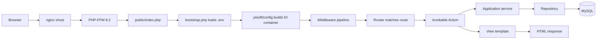
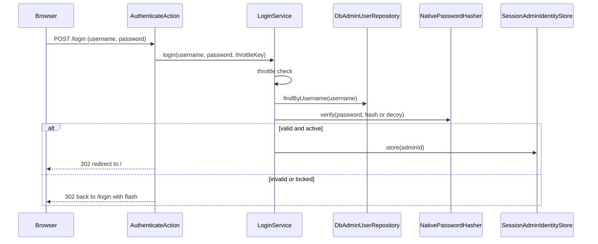
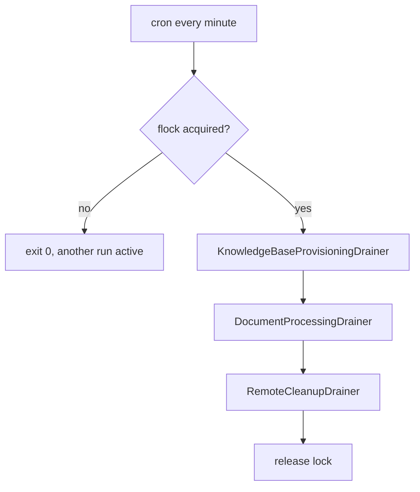
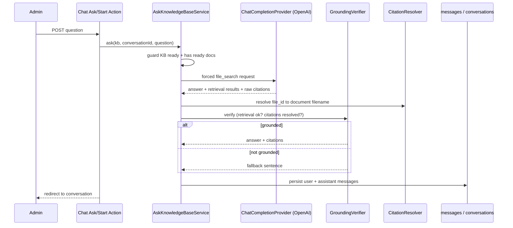
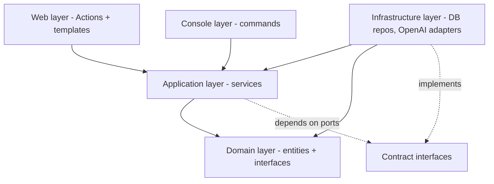
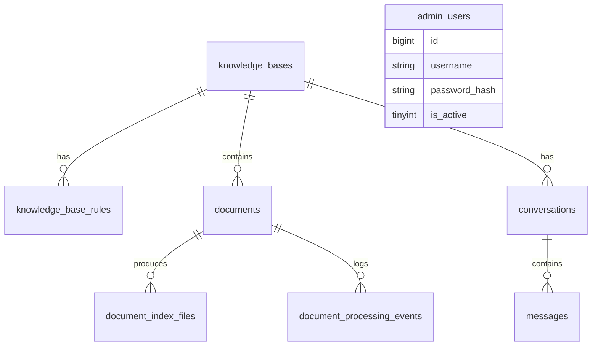

# Knowledge Forge — Project Guide

A beginner-friendly, source-verified guide to this specific project. Everything here was read from the
actual files in `/var/www/html/knowledge-forge`. Where something is a suggestion rather than a fact from
the code, it is marked **Recommendation**.

> **Secrets note:** This guide never contains real keys, passwords, or hashes. Wherever a secret would
> appear, a `<PLACEHOLDER>` is shown instead. The real values live only in `.env`, which is git-ignored.

---

## Table of contents

1. [Project overview](#1-project-overview)
2. [Login page and account access](#2-login-page-and-account-access)
3. [Complete application flow](#3-complete-application-flow)
4. [Project structure](#4-project-structure)
5. [Architecture and dependency flow](#5-architecture-and-dependency-flow)
6. [Application boot process](#6-application-boot-process)
7. [Database configuration](#7-database-configuration)
8. [Database schema](#8-database-schema)
9. [OpenAI configuration](#9-openai-configuration)
10. [Vision probe fix](#10-vision-probe-fix)
11. [Routes and screens](#11-routes-and-screens)
12. [Environment variables](#12-environment-variables)
13. [Local development setup](#13-local-development-setup)
14. [Production deployment guide](#14-production-deployment-guide)
15. [Administration and user management](#15-administration-and-user-management)
16. [Console command reference](#16-console-command-reference)
17. [Worker and cron configuration](#17-worker-and-cron-configuration)
18. [Logging, debugging, and troubleshooting](#18-logging-debugging-and-troubleshooting)
19. [Testing and quality commands](#19-testing-and-quality-commands)
20. [Common developer changes](#20-common-developer-changes)
21. [Safe quick-reference cheat sheet](#21-safe-quick-reference-cheat-sheet)

---

## 1. Project overview

**What it does.** Knowledge Forge is an admin-operated *knowledge-base chat* application. An administrator
creates knowledge bases, uploads PDFs and images into them, and then asks questions that are answered
**only from those documents, with real citations** — or with an explicit fallback sentence when the
documents do not support an answer.

**The problem it solves.** Plain chatbots hallucinate. This app forces every answer through hosted
retrieval and a server-side *grounding check*, so an answer that is not backed by a retrieved, citable
document is replaced by a safe fallback instead of a guess.

**Important features (confirmed in code):**
- Knowledge bases with a name, slug, description, custom instructions, and prioritised enable/disable
  **rules** (`src/KnowledgeBase/`).
- Document upload of PDF/PNG/JPG/WEBP, stored outside the web root, SHA-256 deduplicated
  (`src/Document/`).
- A background **worker** that provisions each knowledge base's OpenAI Vector Store, indexes documents
  (text PDFs directly; images and scanned PDFs are converted to Markdown by a vision model first), and
  cleans up remote files after deletes/re-indexes (`src/Worker/`, `src/Document/Application/`).
- **Grounded chat** with forced File Search, citation resolution back to the original filename, and a
  grounding verifier (`src/Chat/`).
- A durable **operation ledger** so non-idempotent OpenAI "create" calls are never duplicated
  (`ai_operations` table, `src/Ai/Application/Operation/`).

**Technologies / libraries (from `composer.json`):** PHP `8.2 – 8.5`; the Yii3 component set
(`yiisoft/router`, `yiisoft/di`, `yiisoft/db` + `yiisoft/db-mysql` + `yiisoft/db-migration`,
`yiisoft/view`, `yiisoft/session`, `yiisoft/csrf`, `yiisoft/error-handler`, `yiisoft/log`,
`yiisoft/yii-runner-http` / `-console`, `yiisoft/validator`, `yiisoft/config`); `guzzlehttp/guzzle` +
`guzzlehttp/psr7` (HTTP to OpenAI); `league/commonmark` (safe Markdown rendering); `smalot/pdfparser`
(PDF text probe); `vlucas/phpdotenv` (`.env` loading). There is **no OpenAI SDK** — the app talks to
OpenAI through its own small typed gateway.

**Is it admin or user facing?** **Admin-only.** There is a single login and a single account type
(administrator). There is no public/end-user panel and no self-service signup.

**Roles.** The code has exactly **one role: administrator** (`admin_users` table; `AdminUser` entity).
There is *no* separate "system administrator", "knowledge-base owner", or "chat user" concept — any
logged-in administrator can manage every knowledge base and use chat. Those distinctions do **not** exist
in this project.

**Implemented vs not implemented:**

| Area | Status |
|---|---|
| Admin login, session, logout, login throttling | Implemented |
| Knowledge base CRUD + rules (add/edit/toggle/reorder/delete) | Implemented |
| Document upload / delete / retry / reindex / process-now | Implemented |
| Background worker: provisioning, ingestion, remote cleanup, reconcile | Implemented |
| Grounded chat with citations + fallback | Implemented |
| Security headers, correlation id, secret redaction | Implemented |
| Self-service user registration / multiple roles | **Not implemented** (single admin role) |
| Admin password reset command / "list admins" command | **Not implemented** (only create — see §15) |
| Streaming chat, multi-tenancy, S3 storage, DOCX/TXT ingestion | **Not implemented** (documented non-goals) |

---

## 2. Login page and account access

**URL:** `http://knowledge-forge.local/login`. The page text ("Sign in", "Administrator access",
"Username", "Password") comes from `src/Auth/Web/Login/template.php`.

**Is it admin or user login?** It is an **administrator login**. There is only one panel; everything
except `/login` sits behind `RequireAdminMiddleware`, so there is no separate user vs admin panel.

**Who handles the login (all confirmed files):**

| Concern | Where |
|---|---|
| Show form (GET `/login`, route `auth.login.show`) | `src/Auth/Web/Login/ShowAction.php` + `template.php` |
| Submit (POST `/login`, route `auth.login`) | `src/Auth/Web/Login/AuthenticateAction.php` |
| Authentication logic | `src/Auth/Application/LoginService.php` |
| Account lookup / storage | `src/Auth/Infrastructure/DbAdminUserRepository.php` → table **`admin_users`** |
| Password hashing/verify | `src/Auth/Infrastructure/NativePasswordHasher.php` |
| Session identity | `src/Auth/Infrastructure/SessionAdminIdentityStore.php` |
| Login throttle | `src/Auth/Infrastructure/DbLoginThrottle.php` → table **`auth_login_attempts`** |
| Route protection | `src/Auth/Web/Middleware/RequireAdminMiddleware.php` |

**Where usernames live:** the `username` column of `admin_users` (unique index `ux_admin_users_username`).

**How passwords are stored/verified:** hashed with PHP's `password_hash($p, PASSWORD_DEFAULT)` and checked
with `password_verify()` (`NativePasswordHasher`). **Passwords are hashed** (bcrypt by default) — plaintext
is never stored. On a successful login, if the stored hash is weaker than the current default it is
transparently re-hashed (`needsRehash()` in `LoginService`).

**Is there already an admin account?** **No.** A safe read-only check of the local database found
**`admin_users` total: 0** — zero administrator records. No default admin is created by any migration,
fixture, seed, or installer.

**The exact, safe way to create the first administrator** (this is the only supported method):

```bash
cd /var/www/html/knowledge-forge
php yii kf:admin:create            # username defaults to "admin"; prompts hidden for a password
# or choose a username:
php yii kf:admin:create myname
# or force a generated password (non-interactive shells):
php yii kf:admin:create myname --generate-password
```

Implementation: `src/Auth/Console/CreateAdminCommand.php`. Rules from the code: username is 3–64 chars of
letters/digits/`._-`; on a TTY it asks for a hidden password (blank ⇒ generates one; under 12 chars ⇒
generates one instead); the password is **printed exactly once** and never stored in plaintext or passed
as a CLI argument. Creating a username that already exists is refused.

**Reset / change an administrator password:** **Not implemented as a command.** There is no
`kf:admin:reset` or password-change command, and `kf:admin:create` refuses an existing username. See §15
for the supported options (create a second admin, or update the hash directly in the database).

**What happens from submit to session (confirmed):**
1. `AuthenticateAction` reads `username`/`password` from the POST body; empty ⇒ redirect back with a flash.
2. It builds a throttle key from `username` + client IP (`ThrottleKey::for(...)`) and calls
   `LoginService::login()`.
3. `LoginService` checks the throttle; if locked it returns a "locked" result.
4. It looks up the user. It **always** runs `password_verify` — against a decoy hash when the username is
   unknown — so timing does not reveal whether a username exists.
5. Unknown user, wrong password, or inactive account all return the same generic *invalid credentials*
   result, and register a throttle failure.
6. On success: throttle cleared, `last_login_at` recorded, and the admin id is stored in the session
   (`SessionAdminIdentityStore`). The response is a redirect to `dashboard` (Post/Redirect/Get).

**Logout / session / CSRF / rate limiting (confirmed):**
- **Logout:** POST `/logout` (route `auth.logout`) → `src/Auth/Web/Logout/Action.php` → `LogoutService`.
- **Session:** `SessionMiddleware` (yiisoft/session); the id is regenerated on login. Cookie lifetime is
  the framework default; no custom absolute-expiry timer is implemented.
- **CSRF:** `CsrfTokenMiddleware` is in the global stack; every state-changing form posts a token.
- **Rate limiting:** per username+IP. Defaults from `.env`: `AUTH_MAX_LOGIN_ATTEMPTS` (5) failures inside
  `AUTH_LOGIN_WINDOW_MINUTES` (15) triggers a lock for `AUTH_LOGIN_LOCKOUT_MINUTES` (15). Stored in
  `auth_login_attempts`.

**Safe local DB facts (no secrets):** table `admin_users` currently holds **0 records**; therefore no
usernames, statuses, or hashes exist to display. You must create the first admin (above) before you can
log in.

---

## 3. Complete application flow

### Web request flow



The middleware pipeline (from `config/web/di/application.php`, in order): `ErrorCatcher` →
`SecurityHeadersMiddleware` → `CorrelationIdMiddleware` → `SessionMiddleware` → `CsrfTokenMiddleware` →
`RequestCatcherMiddleware` → `Router`. Admin routes add `RequireAdminMiddleware` and
`DomainExceptionMiddleware` inside the group.

### Authentication flow



### Knowledge-base flow

An administrator, all inside `src/KnowledgeBase/` and `src/Document/`:
1. **Creates a knowledge base** (`kb.store` → `CreateKnowledgeBaseService`); the row starts with
   `vector_store_status = 'pending'` — chat/uploads are blocked until the worker provisions it.
2. **Configures rules** (`kb.rules.*` → `RuleService`) — enable/disable and reorder by priority.
3. **Uploads files** (`kb.documents.upload` → `UploadDocumentService`): the file is streamed to
   `runtime/storage/`, hashed, MIME-sniffed, deduplicated, and a `documents` row is created as `queued`.
4. **Ingestion** is not done in the web request — the worker picks up `queued` documents.
5. The worker **provisions** the Vector Store, **uploads/attaches** files to it, or converts
   images/scanned PDFs to Markdown via the vision model, then polls until `ready`.
6. **Status** is tracked on the `documents` row (`queued → processing → indexing → ready/failed`) and
   logged in `document_processing_events`.
7. **Failed** ingestion can be retried (`kb.documents.retry`); a `ready` doc can be re-indexed
   (`kb.documents.reindex`); a queued doc can be expedited (`kb.documents.process-now`).
8. **Delete/replace** (`kb.documents.delete`) soft-deletes the row and flags its remote files for the
   cleanup drainer to detach + delete.

### Worker flow



- Commands: `kf:worker:run` (one pass), `kf:documents:recover`, `kf:ai:reconcile`
  (`src/Worker/Console/`).
- There is **no job-queue table**. "Jobs" are just rows in `knowledge_bases`, `documents`,
  `document_index_files`, and `ai_operations` whose status columns drive the state machine.
- **Claiming** is an atomic conditional `UPDATE` (e.g. `documents` `queued → processing` where affected
  rows === 1), so two workers never process the same item.
- **Retry:** exponential backoff (`DOCUMENT_RETRY_BASE_SECONDS`, doubling, capped at 1h) up to
  `DOCUMENT_MAX_PROCESSING_ATTEMPTS`; then `failed`.
- **Failure/stuck recovery:** a document stuck in `processing` past `DOCUMENT_PROCESSING_TIMEOUT_MINUTES`
  is returned to `queued` by `RecoverStuckDocumentsService` / `kf:documents:recover`.
- **Cron:** a single `flock`-guarded, `nice`-d line, documented in `docs/deploy/worker.md`.
- **Locking:** `src/Worker/Infrastructure/FlockWorkerLock.php` uses the file at
  `DOCUMENT_WORKER_LOCK_PATH`.
- **Runtime dirs:** `runtime/locks/` (lock), `runtime/logs/` (log), `runtime/storage/` (files).

### Grounded chat flow



- Routes: `chat.index` (GET), `chat.start` (POST new), `chat.show` (GET), `chat.ask` (POST follow-up) —
  `src/Chat/Web/`.
- The knowledge base is selected by the `{slug}` in the URL.
- **File Search is forced** (`CHAT_FORCE_FILE_SEARCH=true`), configured in
  `src/Ai/OpenAi/Adapter/OpenAiChatCompletionProvider.php`; if the model rejects a forced tool choice it
  falls back to `auto` and the verifier still governs the outcome.
- The request is one synchronous call via the `ai.client.chat` profile.
- **Citations** are resolved by `src/Chat/Application/Citation/CitationResolver.php` (provider `file_id` →
  `document_index_files` → `documents` → original filename); unresolvable/cross-base ids are dropped.
- **Ungrounded answers are prevented** by `src/Chat/Application/Grounding/GroundingVerifier.php`: no
  retrieval, non-completed retrieval, no results, or (when `CHAT_REQUIRE_CITATIONS=true`) no resolved
  citation ⇒ the configured `CHAT_FALLBACK_MESSAGE`.
- **If OpenAI is unavailable:** the provider throws an `AiException`; the web action shows a "temporarily
  unavailable" flash and the user's question stays recorded.
- **Tables:** `conversations`, `messages` (citations/usage stored as JSON columns). The
  non-idempotent-operation ledger is `ai_operations`.

---

## 4. Project structure

| Folder | Purpose / layer | Notable contents | You usually change… |
|---|---|---|---|
| `public/` | Web entry (doc root) | `index.php` (only PHP reachable over HTTP), `assets/` (published CSS/JS) | rarely |
| `config/` | Wiring (not a layer) | `common/`, `web/`, `console/` sub-configs; `routes.php`; `common/di/*.php` | routes, DI, params |
| `src/` | All application code (PSR-4 `App\`) | feature modules below | most work |
| `src/Shared/` | Cross-cutting | Clock, `SecretValue`, `SecretRedactor`, `MarkdownRenderer`, DB helpers, web middleware/layout | shared utilities |
| `src/Auth/` | Login & admins | `Domain`/`Application`/`Infrastructure`/`Web`/`Console` | auth behaviour |
| `src/KnowledgeBase/` | KBs & rules | entities, repos, CRUD services, provisioning drainer | KB features |
| `src/Document/` | Uploads & ingestion | storage, validators, processors (PDF/image), drainers | ingestion |
| `src/Chat/` | Grounded chat | instruction builder, history policy, citation resolver, grounding verifier | chat behaviour |
| `src/Worker/` | Background runner | `WorkerRunner`, `FlockWorkerLock`, console commands | worker orchestration |
| `src/Ai/` | OpenAI gateway | `Contract/` ports + DTOs, `OpenAi/` client/adapters, operation ledger | provider integration |
| `src/Migration/` | Schema migrations | `M…Create*.php` (8 files) | schema changes |
| `src/Environment.php` | The **only** place env vars are read | typed, fail-fast accessors | add env vars |
| `tests/` | Codeception suites | `Unit/`, `Integration/`, `Functional/`, `Console/`, `Web/`, `Support/Fake/*` | tests |
| `runtime/` | Writable state | `logs/`, `cache/`, `locks/`, `storage/` (uploads + derived Markdown) | never edit by hand |
| `docs/` | Documentation | `deploy/` (permissions, worker), `nginx/`, this guide | docs |

Each feature module follows the same layering: `Domain/` (pure entities + interfaces), `Application/`
(services/use-cases), `Infrastructure/` (DB repos, external adapters), `Web/` (invokable actions +
`template.php`), `Console/` (CLI commands).

---

## 5. Architecture and dependency flow

Clean, layered architecture with dependencies pointing **inward**:



- **Domain** (`*/Domain/`): entities (`AdminUser`, `KnowledgeBase`, `Document`, `Conversation`,
  `Message`), value objects (`ResolvedCitation`, `SecretValue`), and repository interfaces. Confirmed by
  inspection: Domain files import **no** Yii, PSR-HTTP, PDO, Guzzle, or OpenAI classes.
- **Application** (`*/Application/`): use-cases like `LoginService`, `UploadDocumentService`,
  `ProcessDocumentService`, `AskKnowledgeBaseService`, plus config value objects (`ChatParams`,
  `WorkerParams`, `ThrottleParams`). Depends only on Domain + `Ai\Contract\*` ports.
- **Infrastructure** (`*/Infrastructure/`, `src/Ai/OpenAi/`): `Db*Repository` classes, the OpenAI
  HTTP client and adapters, `FlockWorkerLock`. These *implement* the interfaces the inner layers declare.
- **Web** (`*/Web/`) and **Console** (`*/Console/`): thin entry points that call Application services.
- **Dependency injection:** `config/common/di/*.php` binds each interface to its implementation, e.g.
  `AdminUserRepositoryInterface → DbAdminUserRepository` (`auth.php`), `KnowledgeIndexInterface →
  OpenAiKnowledgeIndex` (`ai.php`). Scalars become typed objects in `config/common/di/app-params.php`.
- **Why Domain avoids framework code:** so business rules can be unit-tested with fakes and the AI
  provider or database can be swapped without touching them — e.g. `ChatCompletionProviderInterface` is
  the port; `OpenAiChatCompletionProvider` is one adapter behind it.
- **Boundary enforcement:** `getenv()` appears only in `src/Environment.php`;
  `composer-dependency-analyser.php` checks that every `use`d package is a real dependency; Psalm runs at
  its strictest level.

---

## 6. Application boot process

**Web (execution order):**
1. `public/index.php` — the only web-reachable PHP; builds `HttpApplicationRunner` with
   `debug: Environment::appDebug()`.
2. `src/bootstrap.php` — loads `.env` via phpdotenv (`createImmutable(...)->safeLoad()`; real process env
   wins).
3. Composer autoload (`vendor/autoload.php`).
4. `yiisoft/config` reads `config/*` and assembles the DI container.
5. `config/common/di/*.php` definitions register services (DB, logger, OpenAI, repositories, params).
6. Middleware pipeline is built (`config/web/di/application.php`).
7. `config/common/routes.php` routes are registered.
8. Environment values are read *only* through `src/Environment.php`.
9. The DB connection is created lazily by `src/Shared/Infrastructure/Db/DbConnectionFactory` (bound in
   `config/common/di/db.php`).
10. Errors: `yiisoft/error-handler`; verbose only when `APP_DEBUG=true`.
11. Logging: `yiisoft/log` `StreamTarget` (`config/common/di/logger.php`), context sanitised by
    `SafeLogContext`.
12. Views render via `yiisoft/yii-view-renderer` using each action's colocated `template.php`.

**Console:** entry is `./yii` → `ConsoleApplicationRunner`; same bootstrap/`.env`/DI, commands from
`config/console/commands.php`.

---

## 7. Database configuration

**Confirmed flow:**

```
.env
  → src/Environment.php  (typed accessors, the only getenv() boundary)
  → config/common/params.php  ('app/db' section)
  → config/common/di/app-params.php  (builds the DbParams value object)
  → src/Shared/Infrastructure/Db/DbConnectionFactory  (creates the connection)
  → config/common/di/db.php  (binds ConnectionInterface)
  → repositories (DbAdminUserRepository, DbDocumentRepository, …)
```

- **`.env` variables used:** `DB_HOST`, `DB_PORT`, `DB_SOCKET`, `DB_NAME`, `DB_USER`, `DB_PASSWORD`,
  `DB_CHARSET`.
- **Driver:** MySQL (`yiisoft/db-mysql`, `Yiisoft\Db\Mysql\Connection`).
- **Socket vs TCP:** if `DB_SOCKET` is set, the connection uses the unix socket and `DB_HOST`/`DB_PORT`
  are ignored; otherwise it uses TCP host:port. (Locally `DB_SOCKET=/var/run/mysqld/mysqld.sock`.)
- **Database name:** `DB_NAME` (locally `knowledge_forge_db`).
- **Charset:** `DB_CHARSET` (`utf8mb4`); the connection also sets `time_zone = '+00:00'`.
- **Migrations config:** `config/console/params.php` sets the migration namespace to `App\Migration`
  (folder `src/Migration/`).

**Placeholder-only example (do not paste real secrets):**

```env
DB_HOST=127.0.0.1
DB_PORT=3306
DB_NAME=<DATABASE_NAME>
DB_USER=<DATABASE_USER>
DB_PASSWORD=<DATABASE_PASSWORD>
DB_CHARSET=utf8mb4
# DB_SOCKET=/var/run/mysqld/mysqld.sock   # set to use a unix socket instead of host:port
```

**Commands:**
- Test the connection / status: `php yii kf:health` (checks connect + pending migrations).
- Migration status (pending count): `php yii migrate:new`.
- Apply pending migrations (safe, additive): `php yii migrate:up`.
- Roll back the last migration (**development only**): `php yii migrate:down --limit=1`.
- **Destructive:** `php yii migrate:down --all` reverts *every* migration and **drops all tables/data** —
  never run this in production.

**Recommendation:** use a **dedicated MySQL account** (e.g. `knowledge_forge`) with rights only on the
`DB_NAME` database, not `root`. A least-privilege account limits blast radius if the app or key leaks.
(Locally the project currently uses a root account; that is fine for development only.)

---

## 8. Database schema

All application tables are created by migrations in `src/Migration/`. (Do not confuse these with MySQL
system tables like `information_schema`.)

| Table | Purpose | PK | Key columns | Foreign keys | Used by | Migration |
|---|---|---|---|---|---|---|
| `admin_users` | Administrator accounts | `id` | `username` (unique), `password_hash`, `is_active`, `last_login_at` | — | Auth (`DbAdminUserRepository`, `AdminUser`) | `M260724100000CreateAdminUsers` |
| `auth_login_attempts` | Failed-login throttle records | `id` | throttle key, timestamps | — | `DbLoginThrottle` | `M260724100300CreateAuthLoginAttempts` |
| `knowledge_bases` | Knowledge bases + provisioning state | `id` | `slug` (unique), `openai_vector_store_id`, `vector_store_status`, `status` | — | KnowledgeBase repos + provisioning drainer | `M260724100100CreateKnowledgeBases` |
| `knowledge_base_rules` | Prioritised answer rules | `id` | `knowledge_base_id`, `priority`, `is_enabled`, `instruction` | → `knowledge_bases` | `DbRuleRepository`, `RuleService` | `M260724100200CreateKnowledgeBaseRules` |
| `documents` | Uploaded files + lifecycle | `id` | `knowledge_base_id`, `status`, `checksum_sha256`, `stored_path`, `dedupe_hash`, `priority` | → `knowledge_bases` | `DbDocumentRepository`, upload/processing services | `M260725120000CreateDocuments` |
| `document_index_files` | OpenAI artifacts per document | `id` | `document_id`, `role`, `openai_file_id`, `index_status`, `pending_removal` | → `documents` | `DbIndexedFileRepository`, cleanup drainer | `M260725120000` (+ `M260726090000AddIndexFileRemovalFlag`) |
| `document_processing_events` | Per-document audit log | `id` | `document_id`, `status`, `message` | → `documents` | `DbProcessingEventRepository` | `M260725120000CreateDocuments` |
| `ai_operations` | Non-idempotent op ledger (reconciliation) | `id` | `operation_key` (unique), `type`, `status`, `result_id` | — | `src/Ai/Application/Operation/*`, `kf:ai:reconcile` | `M260725140000CreateAiOperations` |
| `conversations` | Chat threads | `id` | `knowledge_base_id`, `title`, `last_message_at` | → `knowledge_bases` | `DbConversationRepository` | `M260727100000CreateConversations` |
| `messages` | Chat messages | `id` | `conversation_id`, `role`, `content`, `citations_json`, `usage_json`, `is_grounded`, `retrieval_status` | → `conversations` | `DbMessageRepository` | `M260727100000CreateConversations` |



---

## 9. OpenAI configuration

**Where the values are set:** `.env` (git-ignored) — `OPENAI_API_KEY`, `OPENAI_BASE_URL`,
`OPENAI_CHAT_MODEL`, `OPENAI_VISION_MODEL`, plus the timeout/retry/retrieval tunables.

**Which class reads them:** `src/Environment.php` (only). Then `config/common/params.php` (`app/openai`
section) → `config/common/di/app-params.php` builds:
- `App\Ai\OpenAi\OpenAiCredentials` — `apiKey`, `baseUrl`, `chatModel`, `visionModel`.
- `App\Ai\OpenAi\OpenAiParams` — `fileSearchMaxResults`, index-poll settings, `operationMaxAttempts`.
- Two HTTP client profiles under distinct DI ids: **`ai.client.chat`** (impatient, 1 retry — used by
  chat) and **`ai.client.worker`** (patient, more retries — used by ingestion).

**Which services consume them (from `config/common/di/ai.php`):**
- `ChatCompletionProviderInterface → OpenAiChatCompletionProvider` (uses `ai.client.chat`).
- `KnowledgeIndexInterface → OpenAiKnowledgeIndex` and
  `DocumentContentExtractorInterface → OpenAiDocumentContentExtractor` (use `ai.client.worker`).
- `ChatParams` (`config/common/di/chat.php`) carries `OPENAI_CHAT_MODEL` into the ask service.

**Model purposes:**
- `OPENAI_CHAT_MODEL` — answers questions during chat (must support hosted File Search with a forced tool
  choice).
- `OPENAI_VISION_MODEL` — extracts Markdown from images and scanned PDFs during ingestion (must accept
  image input).
- **`OPENAI_EMBEDDING_MODEL` is intentionally absent.** Retrieval is done by **OpenAI-hosted Vector Stores
  + the File Search tool**, which manage embeddings server-side. The app never creates embeddings itself,
  so no embedding model is read or needed. Adding that variable would have no effect (Environment only
  reads its fixed set of keys).

**Vector Stores & File Search:** each knowledge base maps 1:1 to a hosted Vector Store
(`openai_vector_store_id` on `knowledge_bases`). Files are uploaded and attached to it; chat forces the
`file_search` tool against that store. Managed via `OpenAiKnowledgeIndex` and the typed client in
`src/Ai/OpenAi/Client/`.

**Endpoints/abstractions:** a small typed gateway (not an SDK) over `POST /files`, `POST /vector_stores`
(+ files sub-resources), and `POST /responses`.

**Retries / timeouts / errors:**
- Retries and backoff caps come from the profile (`OPENAI_CHAT_*` vs `OPENAI_WORKER_*`); only transient
  statuses (429/5xx/transport) are retried, never 4xx validation.
- Timeouts are split per profile (`*_CONNECT_TIMEOUT_SECONDS`, `*_TIMEOUT_SECONDS`).
- Errors are normalised into `App\Ai\Contract\Exception\AiException` with an `AiErrorDetails` carrying a
  safe message + whether the failure is transient / possibly-had-a-side-effect.

**Secret redaction:** `src/Shared/Infrastructure/Log/SecretRedactor.php` (seeded with the API key and DB
password) scrubs `sk-…`/`Bearer …` from anything logged or persisted; `SecretValue` throws if the key is
stringified. The API key must stay only in `.env` so it never enters code, git, logs, or templates.

**Usage / request ledger:** `messages.usage_json` stores per-answer token usage; the `ai_operations`
table is the durable ledger that makes non-idempotent creates reconcilable (`kf:ai:reconcile`).

**Rotating the key safely:** edit `OPENAI_API_KEY` in `.env`; **re-grant web access** afterwards
(`bash docs/deploy/grant-web-access-acl.sh`, because rewriting `.env` drops its ACL); then reload PHP-FPM
so long-lived workers/pool pick it up: `sudo systemctl reload php8.2-fpm`. CLI commands read `.env` fresh
each run, so no reload is needed for them.

### The two OpenAI-related commands

| Command | Checks | Implemented by | Real API calls? | Consumes usage? | When to run | Does NOT verify |
|---|---|---|---|---|---|---|
| `php yii kf:health` | `.env` readable, DB connect + pending migrations, storage writable, OpenAI *configured?* (keys/models present), chat timeout budget vs web-server timeout, debug flag | `src/Console/HealthCommand.php` + `src/Shared/Application/Health/*` | **No** | No | After any config/deploy change | Whether the key actually works or models are accessible |
| `php yii kf:openai:ping` | chat model responds; vision model accepts an image; forced `file_search` works (creates + deletes a throwaway vector store) | `src/Ai/OpenAi/Console/OpenAiPingCommand.php` | **Yes** | Yes (tiny) | After setting/rotating the key or models | DB/schema/permissions |

**PASS/WARN/FAIL:** PASS = capability confirmed; WARN = usable but degraded (e.g. model won't accept a
*forced* tool choice — the app falls back to `auto`); FAIL = the capability is unavailable and must be
fixed.

---

## 10. Vision probe fix

**Why the old probe failed.** `kf:openai:ping` used to send an inline **1×1 transparent PNG**. Although
that base64 decoded to a technically-valid PNG, the vision model rejects such a degenerate image with
HTTP 400 *"The image data you provided does not represent a valid image."* The command then mislabeled
this as the model refusing image input.

**The fix (current files):**
- `src/Ai/OpenAi/Console/Resources/probe.png` — a genuine, non-trivial 64×64 PNG fixture shipped in the
  repo (not an easy-to-corrupt inline literal).
- `src/Ai/OpenAi/Console/VisionProbeImage.php` — loads and **validates** the fixture before use: file
  exists, is readable, non-empty, survives a base64 round-trip, is recognised by `getimagesizefromstring`,
  has non-zero dimensions, and its detected MIME is `image/png`/`image/jpeg`. The returned `data:` URL's
  declared MIME is the *detected* one, so they cannot disagree. On any problem it throws a clear fixture
  error.
- `src/Ai/OpenAi/Console/OpenAiPingCommand.php` — builds the probe from `VisionProbeImage`; a bad fixture
  is now reported as a **local fixture problem**, distinct from the model genuinely rejecting input.
- `tests/Unit/Ai/VisionProbeImageTest.php` — asserts the payload is a valid PNG data URI with dimensions
  greater than 1×1 and that a missing fixture raises a fixture error.

**Why it is only a capability test:** this image exists solely to prove the vision model accepts image
input. It is never ingested, never stored as knowledge, and is unrelated to user documents.

**Troubleshooting future vision-probe failures:**
- If ping reports a *fixture* error → the `probe.png` file is missing/corrupt; restore it from git.
- If ping reports the *model* rejected input → the model id in `OPENAI_VISION_MODEL` may not support
  images, or the key lacks access; verify the model, then re-run `php yii kf:openai:ping`.

---

## 11. Routes and screens

All routes are in `config/common/routes.php`. Only `/login` (GET/POST) is public; **everything else
requires an authenticated administrator** via `RequireAdminMiddleware`.

| Method | Path | Route name | Action | Auth | Purpose |
|---|---|---|---|---|---|
| GET | `/login` | `auth.login.show` | `Auth\Web\Login\ShowAction` | Public | Login form (`template.php`) |
| POST | `/login` | `auth.login` | `Auth\Web\Login\AuthenticateAction` | Public | Submit credentials |
| POST | `/logout` | `auth.logout` | `Auth\Web\Logout\Action` | Admin | Log out |
| GET | `/` | `dashboard` | `Web\Dashboard\Action` | Admin | Dashboard home |
| GET | `/knowledge-bases` | `kb.index` | `KnowledgeBase\Web\Index\Action` | Admin | List KBs |
| GET | `/knowledge-bases/create` | `kb.create` | `KnowledgeBase\Web\Create\ShowAction` | Admin | New-KB form |
| POST | `/knowledge-bases` | `kb.store` | `KnowledgeBase\Web\Create\StoreAction` | Admin | Create KB |
| GET | `/knowledge-bases/{slug}` | `kb.show` | `KnowledgeBase\Web\Show\Action` | Admin | KB detail (docs + rules) |
| GET | `/knowledge-bases/{slug}/edit` | `kb.edit` | `KnowledgeBase\Web\Edit\ShowAction` | Admin | Edit-KB form |
| POST | `/knowledge-bases/{slug}` | `kb.update` | `KnowledgeBase\Web\Edit\UpdateAction` | Admin | Update KB |
| POST | `/knowledge-bases/{slug}/archive` | `kb.archive` | `KnowledgeBase\Web\Archive\Action` | Admin | Archive KB |
| POST | `/knowledge-bases/{slug}/restore` | `kb.restore` | `KnowledgeBase\Web\Archive\Action` | Admin | Restore KB |
| POST | `/knowledge-bases/{slug}/rules` | `kb.rules.store` | `KnowledgeBase\Web\Rules\StoreAction` | Admin | Add rule |
| POST | `/knowledge-bases/{slug}/rules/reorder` | `kb.rules.reorder` | `KnowledgeBase\Web\Rules\ReorderAction` | Admin | Reorder rules |
| POST | `/knowledge-bases/{slug}/rules/{ruleId}` | `kb.rules.update` | `KnowledgeBase\Web\Rules\UpdateAction` | Admin | Edit rule |
| POST | `/knowledge-bases/{slug}/rules/{ruleId}/toggle` | `kb.rules.toggle` | `KnowledgeBase\Web\Rules\ToggleAction` | Admin | Enable/disable rule |
| POST | `/knowledge-bases/{slug}/rules/{ruleId}/delete` | `kb.rules.delete` | `KnowledgeBase\Web\Rules\DeleteAction` | Admin | Delete rule |
| POST | `/knowledge-bases/{slug}/documents` | `kb.documents.upload` | `Document\Web\Upload\Action` | Admin | Upload a document |
| POST | `/knowledge-bases/{slug}/documents/{documentId}/delete` | `kb.documents.delete` | `Document\Web\Delete\Action` | Admin | Remove a document |
| POST | `/knowledge-bases/{slug}/documents/{documentId}/retry` | `kb.documents.retry` | `Document\Web\Retry\Action` | Admin | Retry a failed document |
| POST | `/knowledge-bases/{slug}/documents/{documentId}/reindex` | `kb.documents.reindex` | `Document\Web\Reindex\Action` | Admin | Re-index a ready document |
| POST | `/knowledge-bases/{slug}/documents/{documentId}/process-now` | `kb.documents.process-now` | `Document\Web\ProcessNow\Action` | Admin | Expedite a queued document |
| GET | `/knowledge-bases/{slug}/chat` | `chat.index` | `Chat\Web\Index\Action` | Admin | Conversation list + new-chat box |
| POST | `/knowledge-bases/{slug}/chat` | `chat.start` | `Chat\Web\Start\Action` | Admin | Start a conversation |
| GET | `/knowledge-bases/{slug}/chat/{conversationId}` | `chat.show` | `Chat\Web\Show\Action` | Admin | One conversation thread |
| POST | `/knowledge-bases/{slug}/chat/{conversationId}` | `chat.ask` | `Chat\Web\Ask\Action` | Admin | Ask a follow-up |

There is **no HTTP health endpoint** — health is CLI-only (`kf:health`).

**Screen flow:** Login → Dashboard → Knowledge bases list → KB detail (upload documents, manage rules,
watch status) → Open chat → Conversation. Each action's view is the `template.php` next to it; the shared
shell is `src/Web/Shared/Layout/Admin/layout.php`.

---

## 12. Environment variables

All are declared and validated in `src/Environment.php` and surfaced via `config/common/params.php`.
Secrets are marked; everything else is non-secret. Changing any value: **CLI reads `.env` fresh each run;
the web/worker tiers need a PHP-FPM reload** (and, because editing `.env` drops its ACL, re-run the ACL
grant script — see §13/§18).

| Variable | Purpose | Req? | Secret | Local example | Production |
|---|---|---|---|---|---|
| `APP_ENV` | Environment name | yes | no | `dev` | `prod` |
| `APP_DEBUG` | Verbose errors to browser | yes | no | `true` | `false` |
| `APP_C3` | Codeception coverage hook | no | no | `false` | `false` |
| `APP_HOST_PATH` | Debug editor-link path | no | no | *(unset)* | unset |
| `DB_HOST` | DB host (TCP) | yes* | no | `127.0.0.1` | DB host |
| `DB_PORT` | DB port (TCP) | yes* | no | `3306` | `3306` |
| `DB_SOCKET` | Unix socket (overrides host/port) | no | no | `/var/run/mysqld/mysqld.sock` | usually unset |
| `DB_NAME` | Database name | yes | no | `knowledge_forge_db` | `<DATABASE_NAME>` |
| `DB_USER` | DB user | yes | no | dev user | `<DATABASE_USER>` |
| `DB_PASSWORD` | DB password | yes | **yes** | `<DATABASE_PASSWORD>` | `<DATABASE_PASSWORD>` |
| `DB_CHARSET` | Charset | yes | no | `utf8mb4` | `utf8mb4` |
| `OPENAI_API_KEY` | OpenAI key | yes | **yes** | `<OPENAI_API_KEY>` | `<OPENAI_API_KEY>` |
| `OPENAI_BASE_URL` | API base URL | yes | no | `https://api.openai.com/v1` | same |
| `OPENAI_CHAT_MODEL` | Chat model id | yes | no | `gpt-5-mini` | your model |
| `OPENAI_VISION_MODEL` | Vision model id | yes | no | `gpt-5-mini` | your model |
| `OPENAI_CHAT_CONNECT_TIMEOUT_SECONDS` / `OPENAI_CHAT_TIMEOUT_SECONDS` / `OPENAI_CHAT_MAX_RETRIES` / `OPENAI_CHAT_RETRY_MAX_BACKOFF_SECONDS` | Chat HTTP profile | yes | no | `5/45/1/2` | tune |
| `OPENAI_WORKER_CONNECT_TIMEOUT_SECONDS` / `OPENAI_WORKER_TIMEOUT_SECONDS` / `OPENAI_WORKER_MAX_RETRIES` / `OPENAI_WORKER_RETRY_MAX_BACKOFF_SECONDS` | Worker HTTP profile | yes | no | `10/120/3/60` | tune |
| `OPENAI_FILE_SEARCH_MAX_RESULTS` | Max retrieval results | yes | no | `8` | tune |
| `OPENAI_INDEX_POLL_INTERVAL_SECONDS` / `OPENAI_INDEX_POLL_MAX_SECONDS` | Indexing poll timing | yes | no | `3/60` | tune |
| `KNOWLEDGE_STORAGE_PATH` | Upload root (alias ok) | yes | no | `@runtime/storage` | persistent path |
| `MAX_UPLOAD_SIZE_MB` / `MAX_IMAGE_UPLOAD_SIZE_MB` | Upload caps | yes | no | `25/8` | ≤ PHP/nginx caps |
| `MAX_DOCUMENTS_PER_KNOWLEDGE_BASE` | Per-KB doc cap | yes | no | `200` | tune |
| `IMAGE_MAX_WIDTH` / `IMAGE_MAX_HEIGHT` | Image dimension caps | yes | no | `12000/12000` | tune |
| `DOCUMENT_WORKER_BATCH_SIZE` | Items per worker pass | yes | no | `1` | raise cautiously |
| `DOCUMENT_MAX_PROCESSING_ATTEMPTS` | Retry cap | yes | no | `3` | tune |
| `DOCUMENT_PROCESSING_TIMEOUT_MINUTES` | Stuck-recovery threshold | yes | no | `20` | tune |
| `DOCUMENT_RETRY_BASE_SECONDS` | Backoff base | yes | no | `60` | tune |
| `DOCUMENT_WORKER_LOCK_PATH` | flock file | yes | no | `@runtime/locks/worker.lock` | persistent path |
| `AI_OPERATION_MAX_ATTEMPTS` / `AI_OPERATION_RECONCILE_WINDOW_MINUTES` | Ledger reconcile | yes | no | `5/120` | tune |
| `PDF_MIN_TEXT_CHARS_PER_PAGE` / `PDF_TEXT_PROBE_MAX_BYTES` / `PDF_VISION_MAX_PAGES` / `PDF_VISION_MAX_BYTES` | PDF ingestion policy | yes | no | `100/26214400/50/26214400` | tune |
| `CHAT_HISTORY_MESSAGE_LIMIT` / `CHAT_HISTORY_CHAR_LIMIT` | History budget | yes | no | `10/8000` | tune |
| `CHAT_MAX_QUESTION_LENGTH` / `CHAT_MAX_OUTPUT_TOKENS` | Chat limits | yes | no | `2000/1200` | tune |
| `CHAT_REQUIRE_CITATIONS` | Suppress uncited answers | yes | no | `true` | `true` |
| `CHAT_FORCE_FILE_SEARCH` | Force retrieval | yes | no | `true` | `true` |
| `CHAT_MIN_CITATION_SCORE` | Min citation score | yes | no | `0.0` | tune |
| `CHAT_FALLBACK_MESSAGE` | Fallback sentence | yes | no | default text | your wording |
| `AUTH_MAX_LOGIN_ATTEMPTS` / `AUTH_LOGIN_WINDOW_MINUTES` / `AUTH_LOGIN_LOCKOUT_MINUTES` | Login throttle | yes | no | `5/15/15` | tune |

\* Either `DB_SOCKET` **or** `DB_HOST`+`DB_PORT` is required. The full annotated template is
`.env.example` — copy it to `.env` and fill in secrets there.

---

## 13. Local development setup

Confirmed against this Ubuntu + native nginx + PHP-FPM project.

```bash
# 1. PHP 8.2 with required extensions (pdo_mysql, curl, fileinfo, mbstring, intl, gd, json, filter)
php -v

# 2. Dependencies
cd /var/www/html/knowledge-forge
composer install

# 3. MySQL database (use a dedicated user in real use; root is dev-only)
#    Create the database named in DB_NAME, e.g. knowledge_forge_db.

# 4. Environment
cp .env.example .env      # then edit .env: DB_* and OPENAI_* (secrets stay only here)

# 5. Schema
php yii migrate:up

# 6. Web server: use docs/nginx/knowledge-forge.dev.conf and map the hostname
echo "127.0.0.1  knowledge-forge.local" | sudo tee -a /etc/hosts
sudo ln -s /etc/nginx/sites-available/knowledge-forge.dev.conf /etc/nginx/sites-enabled/
sudo nginx -t && sudo systemctl reload nginx
# PHP-FPM: sudo systemctl status php8.2-fpm

# 7. Permissions so PHP-FPM (www-data) can read .env + write runtime/ (no sudo, uses ACLs)
bash docs/deploy/grant-web-access-acl.sh

# 8. First administrator (no default exists)
php yii kf:admin:create

# 9. Verify
php yii kf:health
php yii kf:openai:ping      # makes real OpenAI calls

# 10. Worker (optional locally): one pass
php yii kf:worker:run --limit=1

# 11. Tests
composer test
```

> **Important:** whenever you edit `.env`, re-run `bash docs/deploy/grant-web-access-acl.sh` — rewriting
> the file drops its ACL and `www-data` loses read access, causing an "internal server error" in the
> browser while the CLI still works.

---

## 14. Production deployment guide

**Do not assume only the DB name/password change.** Use this change matrix (verified against the code):

| Setting | Local value / source | Change for prod? | File / location | Restart/reload? | Notes |
|---|---|---|---|---|---|
| `APP_ENV` | `dev` | **Yes → `prod`** | `.env` | PHP-FPM | — |
| `APP_DEBUG` | `true` | **Yes → `false`** | `.env` | PHP-FPM | Never true in prod |
| DB host/port/socket | `127.0.0.1` / socket | Maybe | `.env` (`DB_HOST`/`DB_PORT`/`DB_SOCKET`) | PHP-FPM | Prefer TCP to a managed DB |
| `DB_NAME` | `knowledge_forge_db` | Likely | `.env` | PHP-FPM | — |
| `DB_USER` / `DB_PASSWORD` | dev creds | **Yes** | `.env` | PHP-FPM | Use a dedicated least-privilege account |
| `OPENAI_API_KEY` | `<secret>` | **Yes** | `.env` | PHP-FPM | Rotate on deploy |
| `OPENAI_CHAT_MODEL` / `OPENAI_VISION_MODEL` | `gpt-5-mini` | Maybe | `.env` | PHP-FPM | Confirm with `kf:openai:ping` |
| Server name / domain | `knowledge-forge.local` | **Yes → `<PRODUCTION_DOMAIN>`** | nginx vhost (`server_name`) | nginx | Not stored in `.env`; URLs are generated relative to the request |
| TLS certificate | none (dev http) | **Yes** | nginx (`ssl_certificate*`) | nginx | Use `docs/nginx/knowledge-forge.conf` + certbot |
| Document root | `public/` | No | nginx (`root`) | nginx | Keep `public/` only |
| Security headers / HSTS | app-set | No | app (`SecurityHeadersMiddleware`) | — | HSTS auto-added over HTTPS; do not duplicate in nginx |
| Storage/lock paths | `@runtime/...` | Maybe | `.env` (`KNOWLEDGE_STORAGE_PATH`, `DOCUMENT_WORKER_LOCK_PATH`) | PHP-FPM/cron | Put on a persistent, backed-up volume |
| Cron worker | none | **Yes — install** | `crontab -u www-data` | — | See `docs/deploy/worker.md` |
| File permissions | ACL script | **Yes** | `docs/deploy/*.sh` | — | `.env` `0640`, not world-readable |
| MySQL `skip-grant-tables` | dev-only | **Yes — disable** | MySQL server config | mysqld | Then use real password auth |

**Files you edit:** `.env` (secrets + env), the nginx vhost (`server_name`, TLS, root). **Files you must
NOT edit for config:** anything in `src/` or `config/` — configuration flows from `.env` through
`Environment.php`, so **no PHP code changes are needed to change credentials, models, or the domain**.

**Is the domain hardcoded anywhere?** No — URLs are generated by the router relative to the incoming
request, so changing `server_name` in nginx is sufficient; **no application code change and no cache
rebuild is required** for a domain change. (Run `composer yii-config-rebuild` only after editing files in
`config/`.)

**Deployment checklist (also in `README.md`):**
```bash
composer install --no-dev
# .env: APP_ENV=prod, APP_DEBUG=false, real DB_* and OPENAI_* (placeholders here)
php yii migrate:up
bash docs/deploy/grant-web-access-acl.sh        # or docs/deploy/fix-permissions.sh (with sudo)
php yii kf:health                                # expect all PASS
php yii kf:openai:ping                           # expect chat/vision/file_search PASS
# install nginx vhost + TLS; nginx -t && systemctl reload nginx
# install the cron worker for www-data (docs/deploy/worker.md)
php yii kf:admin:create                          # first admin
sudo systemctl reload php8.2-fpm
```

**Restart/reload rules:** `.env` change → `sudo systemctl reload php8.2-fpm` (and re-run the ACL script).
nginx/vhost change → `sudo nginx -t && sudo systemctl reload nginx`. **Rollback:** keep the previous
release dir and the pre-deploy `mysqldump`; migrations here are additive — avoid `migrate:down` in prod.

---

## 15. Administration and user management

| Operation | Supported? | How |
|---|---|---|
| Create administrator | **Yes (CLI)** | `php yii kf:admin:create [username] [--generate-password]` |
| List administrators | **Not implemented** | No command/UI; inspect `admin_users` directly if needed |
| Disable / enable account | **Not implemented as a command/UI** | `is_active` column exists and is honoured at login, but nothing toggles it in-app |
| Reset / change password | **Not implemented** | No reset command; `kf:admin:create` refuses an existing username |
| Delete account | **Not implemented** | — |
| Assign role | **Not applicable** | Single role (administrator) |
| Session invalidation | Partial | `/logout` ends the current session; no "log out everywhere" |

**Recommendation (workarounds until commands exist):** to "reset" a password, either create a new admin
with a different username via `kf:admin:create`, or update the `password_hash` of an existing row in the
database with a freshly generated `password_hash($new, PASSWORD_DEFAULT)` value (generate it with a small
PHP snippet; never store plaintext). To disable an account, set its `is_active` to `0`. These are manual
DB operations, not app features.

---

## 16. Console command reference

Registered in `config/console/commands.php`.

| Command | Purpose | Args / options | Changes data? | Calls OpenAI? | Prod-safe? | Implementation |
|---|---|---|---|---|---|---|
| `kf:health` | Config/DB/storage health + redacted fingerprint | `--json` | No | No | Yes | `src/Console/HealthCommand.php` |
| `kf:admin:create` | Create an administrator | `[username]`, `--generate-password` | **Yes** (inserts a row) | No | Yes | `src/Auth/Console/CreateAdminCommand.php` |
| `kf:openai:ping` | Verify model access + capabilities | — | No (creates+deletes a throwaway store) | **Yes** | Yes (tiny cost) | `src/Ai/OpenAi/Console/OpenAiPingCommand.php` |
| `kf:worker:run` | One ingestion pass | `--limit=N` | **Yes** | Yes (worker profile) | Yes | `src/Worker/Console/RunWorkerCommand.php` |
| `kf:documents:recover` | Requeue stuck documents | — | **Yes** | No | Yes | `src/Worker/Console/RecoverDocumentsCommand.php` |
| `kf:ai:reconcile` | Resolve ambiguous OpenAI ops | `--limit=N` | **Yes** | **Yes** | Yes | `src/Worker/Console/ReconcileCommand.php` |
| `hello` | Template demo | — | No | No | Yes | `src/Console/HelloCommand.php` |
| `migrate:up` | Apply migrations | — | **Yes (schema)** | No | Yes | yiisoft/db-migration |
| `migrate:down` | Revert migrations | `--limit=N`, `--all` | **Yes (drops)** | No | **Dangerous** | yiisoft/db-migration |
| `migrate:new` | Show pending migrations | — | No | No | Yes | yiisoft/db-migration |

---

## 17. Worker and cron configuration

- **Commands:** `kf:worker:run [--limit=N]` (one pass of all drainers), `kf:documents:recover`,
  `kf:ai:reconcile`.
- **Recommended cron (from `docs/deploy/worker.md`)** — single `flock`-guarded, `nice`-d line for
  `www-data`:
  ```cron
  * * * * * /usr/bin/flock -n /var/www/html/knowledge-forge/runtime/locks/worker.lock /usr/bin/nice -n 10 /usr/bin/php /var/www/html/knowledge-forge/yii kf:worker:run --limit=1 >> /var/www/html/knowledge-forge/runtime/logs/worker.log 2>&1
  ```
- **OS user:** `www-data` (same as PHP-FPM), so uploaded and worker-written files are mutually readable
  and both load the same `.env`.
- **Locking/concurrency:** `flock -n` at the cron level **and** `FlockWorkerLock` inside the command —
  overlapping runs never stack; a held lock exits 0.
- **Retry / failure:** exponential backoff up to the attempt cap, then `failed`; stuck items recovered by
  the timeout threshold.
- **Log:** `runtime/logs/worker.log` (cron redirect). **Exit codes:** 0 healthy/nothing/lock-held, 1 an
  item failed, 70 infrastructure fault.
- **Confirm it runs:** `tail -f runtime/logs/worker.log`, or run `php yii kf:worker:run --limit=1` by
  hand.
- **`.env` changes reach workers** because each cron invocation is a fresh process that re-reads `.env`
  (no reload needed for CLI). Re-run the ACL script after editing `.env`.

> **Recommendation:** the repo ships only the cron approach. systemd timers / Supervisor are **not**
> included — adopt them only if you prefer, and treat that as your own addition.

---

## 18. Logging, debugging, and troubleshooting

- **Logs:** `runtime/logs/` (app) and `runtime/logs/worker.log` (cron worker); nginx logs under
  `/var/log/nginx/`; PHP-FPM log under `/var/log/php8.2-fpm.log`.
- **Runtime dirs:** `runtime/{logs,cache,locks,storage}` — must be writable by `www-data`.
- **Correlation id:** every request/run has one; it is stamped on every log record (`SafeLogContext`) and
  returned as the `X-Correlation-Id` response header — use it to tie a browser error to its log lines.
- **OpenAI request ids** are logged in the allow-listed context for support tickets.
- **Secret redaction:** `SecretRedactor` scrubs keys/bearer tokens before anything is logged or persisted;
  never paste `.env` or hashes when sharing logs.

| Symptom | Likely cause | Check | Fix |
|---|---|---|---|
| Browser shows "internal server error" but CLI works | `www-data` cannot read `.env` (ACL dropped after editing) | `getfacl .env` (look for `user:www-data:r`) | `bash docs/deploy/grant-web-access-acl.sh` |
| `kf:health` DB warning/fail | wrong `DB_*` or DB down | `php yii kf:health` | fix `.env`, ensure MySQL running |
| Login always "invalid" | no admin exists / wrong password | `admin_users` count | `php yii kf:admin:create` |
| "Too many failed attempts" | login throttle triggered | `auth_login_attempts` | wait `AUTH_LOGIN_LOCKOUT_MINUTES` |
| Upload rejected | wrong type / too big / duplicate | flash message | use allowed type, shrink, or it's a dedupe |
| Documents stuck `queued` | worker not running | `runtime/logs/worker.log` | run/enable cron `kf:worker:run` |
| Chat blocked | KB not provisioned or no ready docs | KB status / `kf:worker:run` | let the worker finish |
| `kf:openai:ping` vision FAIL | fixture vs model issue | ping message wording | see §10 |
| Migration mismatch | pending migrations | `php yii migrate:new` | `php yii migrate:up` |

---

## 19. Testing and quality commands

| Command | Changes files? | Changes data? | External calls? | Safe to repeat? |
|---|---|---|---|---|
| `composer dump-autoload -o` | Regenerates autoloader | No | No | Yes |
| `./vendor/bin/psalm` | No | No | No | Yes |
| `./vendor/bin/php-cs-fixer fix --config=.php-cs-fixer.php --dry-run` | No (dry-run) | No | No | Yes |
| `./vendor/bin/rector --dry-run` | No (dry-run) | No | No | Yes |
| `./vendor/bin/composer-dependency-analyser --config=composer-dependency-analyser.php` | No | No | No | Yes |
| `./vendor/bin/codecept run` | Test artifacts only | Uses **test** DB in Integration/Web | No (OpenAI faked) | Yes |
| `./vendor/bin/codecept run Unit` | No | No | No | Yes |
| `php yii kf:health` | No | No | No | Yes |
| `php yii kf:openai:ping` | No | No | **Yes (real OpenAI)** | Yes (tiny cost each run) |

All automated tests use fakes for OpenAI — the suite makes **zero** live API calls. (Removing
`--dry-run` from php-cs-fixer/rector **does** rewrite files — omit it only when you intend to apply.)

---

## 20. Common developer changes

| I want to… | Change here |
|---|---|
| Project name / logo / shell | `src/Web/Shared/Layout/Admin/layout.php`, `_sidebar.php`, `assets/main/admin.css` |
| Login-page text | `src/Auth/Web/Login/template.php` |
| Colours / CSS | `assets/main/admin.css` (then it republishes to `public/assets/`) |
| Add a new admin page | new `Action.php` + `template.php` under a module `…/Web/`, then add a route |
| Add a route | `config/common/routes.php` (inside the admin `Group`) |
| Add a DB field | new migration in `src/Migration/`, update the entity + repository |
| Add a migration | create `src/Migration/M…Something.php`, run `php yii migrate:up` |
| Add a service / use-case | `…/Application/` + bind any new interface in `config/common/di/*.php` |
| Add an environment variable | declare it in `src/Environment.php`, expose in `config/common/params.php`, build into a params object in `config/common/di/app-params.php` |
| Change an OpenAI model | `.env` (`OPENAI_CHAT_MODEL` / `OPENAI_VISION_MODEL`) — no code change |
| Change DB credentials | `.env` (`DB_*`) — no code change |
| Change the domain | nginx vhost `server_name` — no code change |
| Add an allowed upload type | `src/Document/Application/Validation/` (MIME/type allow-list) + a processor in `src/Document/Application/Processing/` |
| Change upload limits | `.env` (`MAX_UPLOAD_SIZE_MB`, `MAX_IMAGE_UPLOAD_SIZE_MB`, `IMAGE_MAX_*`) |
| Change worker timing / batch | `.env` (`DOCUMENT_*`) and the cron interval |
| Change security headers / CSP | `src/Shared/Web/Middleware/SecurityHeadersMiddleware.php` |
| Add another user role | **Not supported today** — would require new schema + auth changes (design work, not a config toggle) |

---

## 21. Safe quick-reference cheat sheet

```bash
# Services
sudo systemctl reload php8.2-fpm         # after ANY .env change
sudo nginx -t && sudo systemctl reload nginx   # after a vhost change

# Health / OpenAI
php yii kf:health                        # config/DB/storage (no OpenAI calls)
php yii kf:openai:ping                   # real OpenAI capability check

# Database / migrations
php yii migrate:new                      # pending migrations
php yii migrate:up                       # apply (safe, additive)
# php yii migrate:down --all             # DANGER: drops everything (dev only)

# Worker
php yii kf:worker:run --limit=1          # one pass
tail -f runtime/logs/worker.log          # watch it

# Admin account (no default exists — create the first one)
php yii kf:admin:create                  # prompts for a password; prints a generated one once

# Credentials / config (edit .env, then:)
bash docs/deploy/grant-web-access-acl.sh # re-grant www-data after editing .env
sudo systemctl reload php8.2-fpm

# Change domain: edit nginx server_name only, then reload nginx (no code change)

# Tests / quality
composer test
./vendor/bin/psalm
```

**After editing `.env`:** re-run the ACL script **and** reload PHP-FPM, or the web tier will 500 while the
CLI keeps working.
